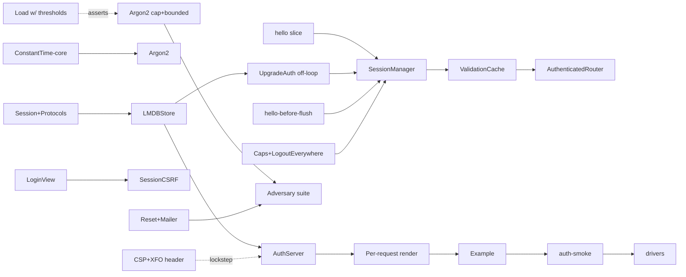

# Implementation Plan — Authentication & Sessions

_Status: proposed, revision 2. revision 2 folds in the plan-skeptic review
(2026-08-27); every change from revision 1 is marked `[r2]`. execution began
2026-08-27 — milestone M0 is implemented (see "execution status" below). to be
evaluated for the M1 phase. references the design decisions in
`Documentation/AUTH_SESSIONS.md` (cited as AD-1…AD-4)._

## Execution status — M0 (2026-08-27)

implemented and green (macOS, Swift 6.3.3): `swift build` 0 warnings/errors;
`swift test` **374 tests across 34 suites** passed, including all of
`WebUIAuthTests` (the current tree totals 398 tests / 35 suites). all M0 items
(M0-T1…T11) delivered.

**QuickLMDB removed from the package (2026-09):** `LMDBAuthSessionStore`, its
tests, and the QuickLMDB dependency were removed from the core package.
`WebUIAuth` ships the `AuthSessionStore` protocol + `InMemoryAuthSessionStore`
only; a persistent store is backend-provided. the quicklmdb lessons recorded
below are preserved for backend implementers who build a store with QuickLMDB.

**M0-T8 quicklmdb lessons — recorded (verified against the pinned revision):**
(1) `MDB_db_get_entry_static` **throws** `.notFound` on a missing key — the
`loadEntry` optional return never delivers nil, so every `loadEntry` must be
guarded by a `containsEntry` check in the same transaction (the contains path
maps NOTFOUND to `false`); (2) the store's `user` reverse index stores raw
fixed-size 16-byte session-id records, so `AuthenticatedSession.id` must be 16
bytes — enforced by a `precondition` in `appendSessionID`; (3) the dup-sort
typed database needs custom `@MDB_comparable()` types, hence the denormalized
index (below).

**M0-T8 deviation — recorded:** the `user` reverse index is implemented as a
denormalized raw array of fixed-size session-id records (a Strict-style base
`Database` entry), not the LMDB dupsort database named in revision 2. the
reason is load-bearing: dupsort requires `MDB_comparable` key types, which
QuickLMDB exposes only via its `@MDB_comparable()` macro designed for
consumer-declared types, and `MDB_val`'s byte-buffer initializers are internal
— fighting the typed wrapper from outside the package. the denormalized form
preserves the exact protocol semantics (logout-everywhere, session caps) with
a per-session rewrite of a small id list. revisit dupsort if session counts
per user make array rewrites costly.

**Dependency decision (A) executed:** QuickLMDB `Package.swift` rawdog range
widened to `20.0.0..<22.0.0` on a local `rawdog21` branch — library builds and
`swift test` compiles cleanly against rawdog 21.0.0 with **no code changes**
(the package's own test target has a pre-existing Swift 6.3 strict-concurrency
failure in a mutable global — unrelated, fix separately). no-webui currently
pins the branch via a **temporary local path** dependency
(`.package(name: "QuickLMDB", path: "../QuickLMDB")`); flip to a URL branch or
`from:`-version pin once the branch/tag is pushed.

**Open M0 items:** (1) push/tag QuickLMDB `rawdog21` (suggest `15.1.0`), then
flip no-webui's manifest line; (2) Linux verification lane — run `swift build`
+ `swift test` on the Ubuntu box to close the cross-platform gate.

**M1-T9 delivered ahead of M1 (2026-08-27):** `WebUIAuthExample` — the
login-gated interactive demo. same interactive model as the smoke page
(counter/progress/echo, optimistic reset) behind an `admin`/`password` login.
implements AD-1: static login page (`includeRuntime: false`) with a
synchronizer CSRF token, single route urlencoded POST, `303` + `Set-Cookie`
(`auth`, HttpOnly, SameSite=Lax, Path=/, Max-Age). hardened after a
software-skeptic pass: WS upgrade refuses foreign/no-origin handshakes and
binds the socket to the session's per-render router; **per-event liveness
gate** — a revoked/expired session's open socket is redirected to `/login`
and closed on its next event (no residual power after logout); request bodies
capped (413) + content-type enforced (415); logout is a CSRF'd POST (GET
returns 405). verification: 16 HTTP + 7 WebSocket checks pass end-to-end
against the running binary (`swift run WebUIAuthExample`, :9091). credential
check runs through `PasswordVerifier` (Argon2id) with dummy-hash
equalization + `constantTimeEquals` username compare. **deliberately NOT in
the demo (plan M2):** Argon2 concurrency cap + bounded queue (M2-T6) — the
login endpoint remains a one-liner CPU/memory flood amplifier; session caps +
sweep (M2-T9/T10); per-session state container (M1-T0 — the demo shares one
global state across sessions). the smoke/fullstack/browser gates are
untouched — this is the plan's separate auth server, not an edit to the
pinned demo.

## How to read this plan

- one unit per row/item. items are commit-sized where coupling allows; where
  change must land atomically across multiple surfaces (e.g. the `hello`
  protocol change), it is one item and the surfaces are listed explicitly —
  including every exhaustive-switch compile site.
- each item lists: surface (files/targets), dependencies, acceptance criteria.
- milestones M0…M3 map to the phases in `AUTH_SESSIONS.md`. every milestone
  ends in a gate; nothing lands on "trust me."
- estimates are relative (S/M/L). a milestone is "done" only when its
  definition of done and its gate both pass.

## Recorded decisions this plan depends on

| ID | Decision | Consequence for the plan |
|---|---|---|
| AD-1 | login is native HTTP form POST; login page ships without the JS runtime | new single-route urlencoded parser; `includeRuntime: false` document convenience |
| AD-2 | one `hello` WS message carries a per-render token | protocol + runtime + both node drivers + both reference servers change atomically (item M1-T2) |
| AD-3 | absolute session expiry, throttled touch, validation-cache backstop | per-event authz is cache reads, not LMDB; primary enforcement is teardown |
| AD-4 | auth HMAC secret persisted in an LMDB metadata env, env-var override | secret lifecycle item M2-T8; rotation invalidates tokens (documented) |

## New dependencies (explicit)

| Dependency | Why | First used by |
|---|---|---|
| ~~`tannerdsilva/QuickLMDB` (+ `CLMDB`)~~ — **removed 2026-09**, see top note | session store was per house LMDB preference (proven in arc-agent/wiremand); no database dependency in the current core | (was) M0-T8 |
| `apple/swift-service-lifecycle` | Second Law: `WebUIAuthServer`, `SessionManager`, sweep are `Service`s under one `ServiceGroup` (the reference servers currently run as bare task groups — the auth server must not) | M1-T1 |
| SMTP client (under `Mailer` protocol) | password reset out-of-band channel — **named, not selected**: provider chosen at M2-T6b, never in the core | M2-T6b |

---

## Milestone M0 — Foundation

**Definition of done:** all types compile and pass Swift Testing with zero
server or wire changes. the package builds on macOS and Linux.

### M0-T1 — `WebUIAuth` target scaffold
- surface: `Package.swift` (new `.target` + `.library` product), `Sources/WebUIAuth/`, empty `WebUIAuth.swift`; `WebUIAuth` depends on `WebUI`, `QuickLMDB`, `rawdog`
- deps: none
- acceptance: `swift build` green; `import WebUIAuth` compiles in a test target

### M0-T2 — identity & credential model
- surface: `Sources/WebUIAuth/Identity.swift`
- `Identity` (`id: String`, `roles: Set<String>`, `Hashable/Codable/Sendable`),
  `Credential` (`username: String`, `secret: [UInt8]`, single-use semantics),
  `Role` helper constants (`"member"`, `"admin"` — strings, app-extensible)
- acceptance: unit tests for codable round-trip, role set semantics

### M0-T3 — `AuthenticatedSession` + protocol set
- surface: `Sources/WebUIAuth/Session.swift`, `Sources/WebUIAuth/Protocols.swift`
- `AuthenticatedSession { id: [UInt8](16), tokenHash: [UInt8](32), identityID, csrfSeed: [UInt8], createdAt, expiresAt, lastSeenAt }`
- protocols `UserStore`, `Authenticator`, `AuthSessionStore` per
  `AUTH_SESSIONS.md`, with nested `Error` types; `AuthSessionStore` includes
  `invalidateAll(for:)`, `listSessions(for:)`, `purgeExpired(before:)`
- acceptance: protocol-only target compiles; session JSON round-trip;
  `tokenHash != token`, token never in JSON

### M0-T4 — session token generation + hash-at-rest
- surface: `Sources/WebUIAuth/Token.swift`
- 32 random bytes from `SecureRandom.bytes` **only** — unreachable via the
  `SystemRandomNumberGenerator` fallback path; SHA-256 (rawdog) hash stored
- acceptance: repeated generation unique; RNG failure fails loudly (no silent
  fallback); `tokenHash = SHA256(token)` verified against rawdog

### M0-T5 — `constantTimeEquals` in the core + CSRF compare fix `[r2]`
- surface: **`Sources/WebUI/ConstantTime.swift`** (new core utility; WebUI has
  no dependency on WebUIAuth and must not acquire one), `Sources/WebUI/Utilities.swift`
  (swap `CSRFProtection.validate` — `Utilities.swift:309`
  `signature == expectedSignature`), `Sources/WebUIAuth/` consumes it
- `[r2]` revision-1 placed this in `Sources/WebUIAuth/` while also patching
  `WebUI/Utilities.swift` — that forces a WebUI → WebUIAuth cycle (WebUIAuth
  necessarily depends on WebUI). the utility belongs in the core target.
- acceptance: `constantTimeEquals` passes equal/unequal/length-differ vectors;
  existing CSRF tests stay green

### M0-T6 — cookie parse/build
- surface: `Sources/WebUIAuth/Cookie.swift`
- pure-Swift `HTTPCookie` parse from `Cookie` header, `Set-Cookie` builder with
  the full flag surface (`HttpOnly`, `Secure`, `SameSite=Lax`, `Path=/`,
  `Max-Age`, `__Host-` prefix rules: requires Secure + no Domain + Path=/)
- acceptance: round-trip tests; every illegal attribute combination rejected;
  `__Host-` prefix constraints enforced

### M0-T7 — `InMemoryAuthSessionStore`
- surface: `Sources/WebUIAuth/InMemoryAuthSessionStore.swift`
- actor-backed test double: create/find/touch/invalidate/invalidateAll/
  listSessions/purgeExpired; concurrent access safe
- acceptance: full lifecycle tests; logout-everywhere fan-out of the model

### M0-T8 — `LMDBAuthSessionStore` *(delivered, then removed from the package — see the top-of-plan note)*
- surface: `Sources/WebUIAuth/LMDBAuthSessionStore.swift`; `Package.swift`
- QuickLMDB dependency; one persistent environment (never the transient
  open/close-per-call pattern); schema per `AUTH_SESSIONS.md`:
  `tok:<sha256>` primary, `user:<identityID>` DupSort over session IDs,
  `audit:<seq>` append-only
- LMDB discipline: one read txn per thread — a second read txn opened before
  the first is exhausted throws `badReaderSlot`; share a single txn per lookup.
  for dup-sort value membership prefer cursors; `[r2]` the base
  `Database.containsEntry(key:value:)` may exist in the pinned QuickLMDB
  revision — verify against the resolved revision and use whichever is
  available without re-opening nested txns
- absolute-expiry policy default; `touch` throttled (once / 60 s) (AD-3)
- **must be M/L sized** — heaviest M0 item; gates M1-T1 and M1-T3
- acceptance: persistence across env close/reopen; dup-sort membership;
  invalidation removes both directions; concurrent reader/writer stress test;
  green on Linux (LMDB env lifecycle verified under a temp dir)

### M0-T9 — Argon2id password wrapper
- surface: `Sources/WebUIAuth/PasswordVerifier.swift`
- wrap `RAW_argon2.ID` (Argon2id): hash with `(timeCost, memoryCost,
  parallelism)` persisted alongside salt; verify = re-hash +
  `constantTimeEquals`; self-describing parameter serialization (PHC-shaped);
  **dummy-hash** path for unknown users (fixed cost)
- hand-built verify is new code — this is where bugs live, so vector tests:
  known Argon2id vectors (RFC 9106), round-trip, wrong-password,
  parameter-drift failures. **must be M sized.**
- acceptance: vector suite green; verify rejects tampered params field

### M0-T10 — `AuthContext`
- surface: `Sources/WebUIAuth/AuthContext.swift`
- `@TaskLocal` carrying `(session, identity?)`; mirrors `RenderContext`
  mechanics; no-op-safe when unset (warnings, not crashes)
- acceptance: TaskLocal read/write across await boundaries; concurrent test

### M0-T11 — test suite organization + shared harness `[r2]`
- surface: `Tests/WebUIAuthTests/` — one file per `@Suite`; a shared
  `TestEnvironment` helper: temp-dir LMDB env lifecycle (setUp/tearDown,
  reopen), seeded-user fixtures (pre-computed Argon2 hashes), ServiceGroup
  harness for M1+ suites
- suites: token, cookie, constantTime, session-store (in-memory + LMDB),
  password-verifier, identity, auth-context
- acceptance: `swift test` on macOS and Linux green; LMDB suites run against
  fresh temp envs and clean up after themselves

**M0 gate:** `swift build` + `swift test` green on both platforms; QuickLMDB +
lifecycle deps resolved and recorded.

---

## Milestone M1 — Server + Wire

**Definition of done:** `WebUIAuthExample` runs login → dashboard → logout
end-to-end on localhost under **per-request rendering** with per-identity
state; the `hello` handshake is pinned; CSP delta is in and behavioral.
**`[r2]` deployability caveat:** the public `POST /login` endpoint exists from
M1-T1 onward but is NOT hardened until M2-T5/T6 — M1 is an in-repo milestone,
not a deployable release.

### M1-T0 — per-request render + per-render router + per-identity state `[r2] NEW`
- surface: `Sources/WebUIAuthExample/main.swift` (and, for the gate, the smoke
  server) — **this item is the architectural reality the rest of M1 assumes**:
  `GET /` renders a fresh page per request with a fresh `EventRouter` per
  render pass (house rule), registers it by render token in `SessionManager`,
  and binds it to the resolved session's identity
- per-identity state container: replaces the single global
  `ExampleState`/`SmokeState` with state keyed by `identityID` (an actor-owned
  `[identityID: state]` map), so the M1-T9 acceptance ("second user cannot see
  the first user's state") has a real backing store
- acceptance: two logged-in users on one server hold disjoint state; each
  request re-renders with fresh component IDs; the startup one-router model of
  today's servers (`WebUIExample/main.swift:125–126,270`) is gone in the auth
  example

### M1-T1 — `WebUIAuthServer` Service
- surface: `Sources/WebUIAuth/Server/WebUIAuthServer.swift`; `Package.swift`
- a swift-service-lifecycle `Service`: route table (`GET /login`, `POST /login`,
  `POST /logout`, `GET /`, `WS /ws`), the single-route
  `application/x-www-form-urlencoded` body reader (AD-1), `303` + `Set-Cookie`
  emission, cookie `Max-Age` matched to session `expiresAt`,
  `Secure`-over-plain-HTTP warning + localhost dev override
- deps: M0-T6, M0-T8
- acceptance: ServiceGroup start/stop clean (needs swift-service-lifecycle in
  the test target — M0-T11 harness); POST body parsed correctly plus malformed
  body 400; cookie flags exact; the `Secure` warning fires

### M1-T2 — `hello` handshake (atomic across all compile sites) `[r2]`
- surface, one commit: `Sources/WebUI/WebSocketProtocol.swift`
  (`WSIncoming.hello`), `Sources/WebUI/HTMLDocument.swift` (emit
  `data-webui-render` on `body`), `designer/assets/webui-runtime.js` (send
  `hello` with the render token once on open, **before any queued flush** —
  see M1-T2b), runtime string pins, **and both reference servers**
  `Sources/WebUISmokeTest/main.swift` + `Sources/WebUIExample/main.swift`
  (they switch `WSIncoming` exhaustively with no `default` —
  `WebUISmokeTest/main.swift:263–278`, `WebUIExample/main.swift:229–240`;
  adding a case breaks their compilation, so they land in the same commit with
  `hello` → no-op/route to the session manager)
- `[r2]` revision-1 omitted the two reference-server switches; the atomic
  commit as specced could not close the build.
- acceptance: pin tests green; a render carries a unique token; two renders
  never collide; both reference servers compile and tolerate a runtime that
  now sends `hello` (the browser-smoke driver runs the real runtime)

### M1-T2b — event-before-hello ordering + cross-session render-token edge `[r2] NEW`
- surface: `designer/assets/webui-runtime.js` (+ pins), `SessionManager`
  buffering policy
- the runtime flushes its queue on `onopen` (`webui-runtime.js:54–62,129–139`);
  pin "send `hello` before flushing" so no application event precedes
  connection establishment. the server defines buffered-vs-dropped handling
  for anything arriving before the `hello` binds a router: **drop with a
  warning** (an unbound event is untrusted by definition)
- the cross-session edge: a page rendered under session A reconnecting with
  cookie B (after revoke → re-login in the same tab) must not bind to A's
  router — the hello's render token is looked up **in the context of the
  cookie's session**, so a token registered under A is unattributable under B
  and the server responds `redirect` + close
- acceptance: runtime unit/pin test proves hello precedes flush; a stale
  render token under a new session yields redirect+close, not router binding

### M1-T3 — upgrade auth + Origin check + off-loop resolution `[r2]`
- surface: `Sources/WebUIAuth/Server/UpgradePolicy.swift`
- `shouldUpgrade` (a sync closure returning `EventLoopFuture`) must: resolve
  the session **off the NIO event loop** (a blocking LMDB read there stalls
  every connection on that loop — hop to the store actor first), validate
  `Origin == Host`, and reject with 403 via the
  `notUpgradingCompletionHandler` (bodyless, no page bytes, no reason leakage)
- `[r2]` revision-1 specified the check but not the off-loop bridge or the
  403 plumbing; both are itemized here.
- acceptance: no-cookie, bad-cookie, expired-cookie, foreign-Origin all
  rejected with a 403 response carrying no page bytes; valid cookie upgraded;
  the event loop is not blocked (login under load stays responsive — probe the
  loop latency, not just correctness)

### M1-T4 — `SessionManager` actor
- surface: `Sources/WebUIAuth/Server/SessionManager.swift`
- `session → [connections]`, `connection → (renderToken) → router` (AD-2);
  `connect(session:render:)`, `disconnect(connection:)`,
  `invalidate(session:)` → fan-out: `{type:"redirect", url:"/login"}` then
  close each connection — teardown-before-push ordering
- deps: M1-T2, M1-T2b, M1-T3
- acceptance: connect/rebind/disconnect/invalidate lifecycle tests;
  multi-tab correctness (two connections, two routers, one session row);
  reconnect rebinds to the existing router; event-before-hello drops with a
  warning and does not crash

### M1-T5 — validation cache `[r2 reordered]`
- surface: `Sources/WebUIAuth/Server/ValidationCache.swift`
- **built before `AuthenticatedRouter`, which consumes it** — revision-1
  ordered the router first and left the cache dangling as a forward
  dependency; the mermaid graph now draws `M1-T4 → M1-T5 → M1-T6`.
- LRU cache `sessionID → validatedUntil` (60 s window); `invalidate()` purges
  its rows immediately (staleness applies to past checks only, never to
  post-invalidate checks)
- acceptance: window expiry with controllable time; cache-miss → DB recheck;
  invalidation purges within one clock tick; concurrent invalidate+check
  resolves to denied

### M1-T6 — `AuthenticatedRouter`
- surface: `Sources/WebUIAuth/Server/AuthenticatedRouter.swift`
- wraps `EventRouter` dispatch: liveness backstop against the validation cache
  (AD-3) before running handlers; sets `AuthContext` via `@TaskLocal` around
  `handle()`; exposes the bound session for audit/logging
- hard rule: no `Task.detached` inside handlers on this path; audit reads the
  bound session, not the TaskLocal
- deps: M1-T5
- acceptance: revoked session `handle` returns auth-denied fragments/no-op;
  stale-cache-to-DB reconciliation passes; multi-tab dispatch isolated

### M1-T7 — CSP delta: meta-valid directives + clickjacking header `[r2]`
- surface: `Sources/WebUI/HTMLDocument.swift`, the auth server + example
  response layer, M0-T11 harness, smoke/fullstack/pins
- `[r2]` correction: CSP delivered via `<meta>` ignores `frame-ancestors`
  (header-only directive per CSP3). therefore:
  - add `form-action 'self'` and `base-uri 'self'` to the meta CSP (both are
    meta-valid; today absent — `HTMLDocument.swift:34`)
  - clickjacking is handled by a **real HTTP header**: `X-Frame-Options:
    SAMEORIGIN` (header-only, like `frame-ancestors`) emitted by
    `WebUIAuthServer` responses and the auth example
  - `frame-ancestors` does NOT go in the meta CSP — it would be inert and
    lull the reviewer. no gate currently pins CSP directive content
    (`WebUISmokePlugin.swift:120` checks only `http-equiv` presence), so the
    meta change breaks no byte pins, but the smoke/fullstack pages re-employ
    the updated document and their **behavioral** checks (not byte pins) are
    re-run in the same commit
- acceptance: **behavioral** — an authenticated page rendered by
  `WebUIAuthServer` carries `X-Frame-Options: SAMEORIGIN` and will not render
  in a cross-origin iframe (probe with a live iframe test, not a substring
  check); the meta CSP contains `form-action 'self'` + `base-uri 'self'`

### M1-T8 — runtime: queue scrub + configurable terminal failure path `[r2]`
- surface: `designer/assets/webui-runtime.js`, `Sources/WebUI/RuntimeConfig.swift`
  + bootstrap, pins
- scrub the offline message queue on server-initiated `redirect`; capped
  reconnect attempts then `location.replace(target)` — **both the cap
  (default 5) and the terminal target (default `/login`) are `RuntimeConfig`
  knobs**, not hardcoded into the shared runtime: a non-auth app must not be
  dumped on a 404 `/login` after a flaky network (DEFAULTS today has no
  reconnect-cap field — `webui-runtime.js:5–16`; adds a key + field +
  bootstrap key + pin)
- `[r2]` revision-1 hardcoded `/login` into the shared runtime; this item
  makes it configurable with an auth-appropriate default.
- acceptance: queued events never replay across a session boundary
  (regression in browser-smoke context); terminal path fires after the cap and
  the target is honored; non-auth app with `wsReconnect` and default knobs
  never redirects anywhere (terminal path off unless configured)

### M1-T9 — `WebUIAuthExample`
- surface: `Sources/WebUIAuthExample/` (executable), seeded member/admin users
  via the M0-T11 fixture mechanism (pre-computed Argon2 hashes)
- demonstrates: login page (static, no runtime), member dashboard (counter +
  reservation-stub rows per user), logout, session expiry → login redirect,
  per-identity state (M1-T0)
- deps: all of M1
- acceptance: manual script: login → interact → logout; second user cannot see
  the first user's state; reload keeps the session; expiry lands on the login
  page

**M1 gate:** `WebUIAuthExample` end-to-end on localhost per M1-T9 acceptance;
`swift test` green including new protocol/runtime pins; `swift build` clean.
**Not deployable: M2 hardening (throttle, cap, CSRF binding) pending.**

---

## Milestone M2 — Hardening + UX

**Definition of done:** the public-auth surface is hardened per the security
table; adversary probes pass; the `ARCHITECTURE.md` security table is extended
**`[r2]` in this milestone** (M2-T12), not deferred to M3.

### M2-T1 — login page views
- surface: `Sources/WebUIAuth/Views/LoginView.swift`
- `LoginView` (username/password/pre-auth CSRF + `next` field) rendered by a
  `LoginDocument` using `includeRuntime: false` (AD-1); generic error text,
  fresh CSRF token on re-render
- acceptance: rendered HTML has no runtime script, has the CSRF hidden field,
  has no interactive component ids; error re-render carries a new token

### M2-T2 — route guards
- surface: `Sources/WebUIAuth/Guards.swift`
- `RequiresLogin`, `RequiresRole(_:)` — render-time guards producing the
  protected subtree or a login redirect; composable with the view tree
- acceptance: guard matrix tests (public / member / admin × logged-out /
  member / admin)

### M2-T3 — `next` allowlist
- surface: `Sources/WebUIAuth/NextPolicy.swift`
- server-side allowlist for post-login redirect targets; default same-origin
  path prefix; rejects `//`, scheme-qualified, backslash-obfuscated targets
- acceptance: allowlist matrix; open-redirect payloads rejected

### M2-T4 — session-bound CSRF **scoped to native POST routes** + logout `[r2]`
- surface: `Sources/WebUI/Utilities.swift` (token extension),
  `Sources/WebUIAuth/SessionCSRF.swift`, the logout route
- `[r2]` scoping correction: WS event messages need no CSRF —
  `Origin == Host` + `SameSite=Lax` already cover the cross-site vector.
  session-bound tokens (`sessionID:formID:expiration` in the HMAC payload)
  protect **native form POSTs only** — today that is exactly `POST /logout`
  and any future native POST (uploads, etc.). the validation site is the
  server's native-POST handler (the logout route), and only there.
- logout control renders **without** an event-handler modifier so the runtime
  does not `preventDefault` its submit (`webui-runtime.js:261–263`) — stated
  here as the required rendering rule for native-POST controls.
- acceptance: cross-session replay of a stolen token fails **at the logout
  POST handler**; pre-auth login token works without a session; logout
  requires a valid token; a logout button with no handler modifier submits
  natively (browser probe)

### M2-T5 — credential throttle + trusted-proxy config
- surface: `Sources/WebUIAuth/Throttle.swift`
- per-account + per-IP attempt log (LMDB); trusted-proxy list for
  `X-Forwarded-For`; unconfigured → key on the socket peer; **`[r2]` the
  backoff formula and lockout duration are documented constants** (e.g. linear
  backoff × failure count, lockout 15 min) and verified by test
- acceptance: lockout after N (default 5) failures with the documented backoff;
  per-IP keying correct with and without trusted proxy headers; spoofed XFF
  ignored when unconfigured; the default 5 and the schedule are asserted, not
  just the effect

### M2-T6 — Argon2 concurrency cap with a **bounded** queue `[r2 split]`
- surface: `Sources/WebUIAuth/PasswordVerifier.swift` (cap), `Throttle.swift`
- `[r2]` revision-1's "actor-gated queue" was unbounded — a flood queues
  unbounded work and unbounded waiting, which is itself the DoS the item
  claims to stop. this item adds: a **bounded queue** (default 64 pending)
  with overflow → fast-fail `503`-style denial, and a **login-request timeout**
  (default 10 s) so a saturated box fails fast instead of piling waits.
- global hash concurrency default 4 (acquitted by review as defensible)
- acceptance: flood test asserts concurrency ≤ 4, queue length ≤ 64, overflow
  denied, login latency bounded by the timeout — the numbers are pinned in the
  test, not just showed by example

### M2-T6b — reset/recovery behind `Mailer` (split from T6) `[r2]`
- surface: `Sources/WebUIAuth/Reset/` (ticket, `Mailer` protocol,
  issuance/consumption endpoints)
- single-use HMAC reset ticket with short expiry (like CSRF) and
  consumed-on-use semantics; `Mailer` protocol isolates the never-named SMTP
  provider (provider selected here, never in the core)
- acceptance: ticket reuse fails; expired ticket fails; mailer double (test)
  receives a deterministic message; issuance and consumption are audited
  (M2-T7)

### M2-T7 — audit trail
- surface: `Sources/WebUIAuth/Audit.swift`
- `AuthEventAudit`: login success/failure, logout, revocation, reset issue/
  consume — swift-log always; optional LMDB `audit:` append-only; bounded
  retention
- acceptance: event records carry session/identity (from the bound session,
  not the TaskLocal); log order stable under concurrency

### M2-T8 — secret persistence + rotation
- surface: `Sources/WebUIAuth/Secrets.swift`; `Package.swift`
- auth HMAC secret generated on first boot, persisted to `webui_auth_meta`
  LMDB env; `WEBUI_AUTH_SECRET` env override; explicit `rotate` path;
  rotation invalidates outstanding signed tokens (documented, accepted)
- acceptance: fresh boot persists + reloads; env override wins; rotation
  invalidates old tokens within one CSRF max-age

### M2-T9 — sweep service
- surface: `Sources/WebUIAuth/Server/SessionSweepService.swift`
- 5-minute cadence: purge expired session rows + stale throttle attempts
  (`[r2]` note: validation-cache cells self-expire by TTL — the sweep does not
  need to chase them); a `Service` in the `ServiceGroup`
- acceptance: expired rows vanish; running under ServiceGroup shutdown cleanly

### M2-T10 — session caps + logout-everywhere wiring
- surface: `Sources/WebUIAuth/SessionPolicy.swift`
- concurrent-session cap (default 10/user, oldest evicted); `invalidateAll`
  via the `user:` secondary index wired to `SessionManager` fan-out
- acceptance: 11th login evicts oldest; logout-everywhere closes N connections
  and N routers within one fan-out

### M2-T11 — adversary probe suite **`[r2] scoped`**
- surface: `Tests/WebUIAuthTests/Adversarial/`
- Swift-side probes: revoked-mid-connection (event after revoke → denied,
  socket closed), CSRF replay across sessions **at the native-POST validation
  site**, throttled flood under the Argon2 cap, enumeration timing
  (dummy-hash equalizes), `__Host-` cookie flag check
- **`[r2]` removed:** the queued-message-replay probe is browser-runtime
  behavior a Swift test cannot exercise — it lives as the M1-T8 browser-smoke
  regression instead. one owner, not two.
- acceptance: every probe passes; each probe documents the attack it models

### M2-T12 — security table extension in this milestone `[r2 NEW]`
- surface: `Documentation/ARCHITECTURE.md` security table
- rows added: clickjacking (`X-Frame-Options`), account enumeration
  (dummy-hash), credential DoS (bounded Argon2), open redirect (allowlist),
  revocation-enforcement model (teardown + backstop)
- `[r2]` revision-1's M2 gate referenced M3-T7 for this — a gate that could
  not pass inside its own milestone. the docs move into M2.

**M2 gate:** adversary suite green; `ARCHITECTURE.md` table (M2-T12) reflects
implemented lines; the M1-deployability caveat is lifted.

---

## Milestone M3 — Gates + Ops

**Definition of done:** auth ships with its own gate, drivers, runbooks, and
load data. existing framework gates stay green with pins updated only where an
M1/M2 item explicitly changed them in the same commit.

### M3-T1 — `auth-smoke` gate
- surface: `Plugins/WebUIAuthSmokePlugin/` + server target
- self-contained, follows the existing gate discipline: spawns
  `WebUIAuthSmokeTest`, checks, tears down; `--disable-sandbox` placed before
  `plugin`; respects the `.build` lock (never concurrent with `serve`)
- checks: login POST → `Set-Cookie` → authenticated WS upgrade (`hello` binds)
  → round-trip → logout teardown → expiry redirect; seeded credentialed user
- acceptance: gate green alone and in sequence with `smoke`/`fullstack-smoke`

### M3-T2 — fullstack auth driver `[r2 path fix]`
- surface: **`designer/fullstack-smoke.mjs`** (the driver is resolved by the
  plugin at `Plugins/WebUIFullstackSmokePlugin/WebUIFullstackSmokePlugin.swift:54–55`
  — `[r2]` revision-1 cited the wrong path)
- login step + cookie forwarding for the authenticated WS round-trip; render
  token assertions (hello binds correct router)
- acceptance: fullstack auth path drives a live authenticated round-trip

### M3-T3 — browser auth driver
- surface: `designer/browser-smoke.mjs`
- Playwright: login UI flow; authenticated counter/echo survival;
  session-expiry → login redirect probe; optimistic + scroll survival under
  auth; the M1-T8 queue-scrub regression
- acceptance: browser gate green with the login step inlined

### M3-T4 — load test with a pass threshold `[r2]`
- surface: a Swift executable or command plugin (no ad-hoc shell scripts)
- Argon2 cap under flood; validation-cache hit rate; LMDB single-writer
  contention; login-path p99; queue-overflow behavior
- **`[r2]` revision-1 had no pass condition — a gate item that cannot fail.**
  pass threshold (explicit, asserted): concurrency ≤ 4, queue ≤ 64, overflow
  denied, login p99 ≤ 800 ms at 50 req/s against a fixed seeded box. numbers
  recalibrated from the first run and recorded in the runbook.
- acceptance: recorded numbers vs. the asserted thresholds

### M3-T5 — TLS/HSTS runbook + proxy notes `[r2]`
- surface: `Documentation/OPS_AUTH.md`
- TLS termination topologies (direct + proxy), HSTS policy, `Secure` cookie
  behavior per topology, cert rotation, and **`[r2]` the
  `Origin == Host` check under a Host-rewriting reverse proxy** — the check
  compares against the internal host; the runbook documents the proxy
  forwarding rules that keep it sound (preserve Host, or configure the trust
  list accordingly)
- acceptance: document reviewed; `Secure` cookie behavior verified in each
  topology

### M3-T6 — backup/restore + rotation runbooks
- surface: `Documentation/OPS_AUTH.md`
- LMDB env backup/restore (member hashes + sessions are catastrophic-loss
  data), secret rotation procedure, audit retention
- acceptance: restore verified against a seeded backup

### M3-T7 — documentation sweep
- surface: `Documentation/API.md` (new types, cookie, guards),
  `Documentation/AUTH_SESSIONS.md` (status → implemented), `AGENTS.md` (new
  verbs `auth-smoke`, new pitfalls: login-vs-WS, Secure-cookie dev,
  QuickLMDB read-txn discipline, render-token rule, per-request-render rule),
  `Documentation/IMPLEMENTATION_PLAN.md` (status → executed), `README.md`
- lowercase comment style; every backticked flag pinned by tests where
  applicable
- acceptance: docs reflect code; no dead-end references

**M3 gate:** full verification stack green: `swift build` → `swift test` →
`smoke` → `fullstack-smoke` → `auth-smoke` → `browser-smoke` → `probe` sanity.

---

## Dependency graph `[r2 updated]`

## Cross-cutting rules (enforced on every item)

- Swift Testing (`@Test`/`#expect`); one `@Suite` per file; shared harness
  from M0-T11
- tabs; lowercase comments in Swift; comment-free shipped html/css/js
- Second Law: long-lived pieces are `Service`s under one `ServiceGroup` —
  `SessionManager`, sweep, server all in the same group; test target carries
  swift-service-lifecycle
- one `EventRouter` per render pass; render token per page (AD-2); **per-request
  rendering is the server model** (M1-T0)
- no `defer { await … }`; no `fatalError()` in macros; `Int` over `size_t`
- QuickLMDB: one read txn per thread; dup-sort membership without nested txns
- no ad-hoc `shutdown()`; cleanup at the end of `Service.run()`
- `hello` is the only new WS message; the `script` message stays banned
- byte-pinned surfaces change only inside the item that owns the change, with
  the pins updated in the same commit

## Risk register (execution) `[r2 updated]`

| Risk | Mitigation |
|---|---|
| `hello` slice touches four pinned/compile surfaces | one atomic commit; both reference servers included (M1-T2) |
| CSP change semantics (meta vs header) | behavioral acceptance, not substring checks (M1-T7) |
| per-request render is a model change, not a flavor | explicit M1-T0 item ahead of the servers that depend on it |
| LMDB single-writer contention under events | per-event authz = cache reads (M1-T5); writes on the store actor |
| TaskLocal bleed across concurrent handlers | hard no-`Task.detached` rule; audit reads bound session (M1-T6) |
| public login endpoint ships unhardened at M1 | M1 explicitly not deployable; caveat in the milestone DoD |
| unbounded hash queue defeats the cap | bounded queue + timeout, thresholds asserted (M2-T6) |
| QuickLMDB dep surprises on Linux | proven in arc-agent/wiremand; M0-T8 has a Linux lane; harness temp envs |
| driver path drift | M3-T2 pinned to the real path; plugin resolution double-checked |
| scope creep (WebAuthn/registration/scale) | explicit non-goals; see below |

## Explicit non-goals (out of scope for this plan)

- WebAuthn/passkeys (v2; `Authenticator` is shaped for it)
- self-service registration (members provisioned by staff)
- horizontal scale / multi-node sessions (single-node LMDB, recorded)
- client-side frameworks, npm, external CSS/JS
- anything that weakens the security invariants in `ARCHITECTURE.md`

## Global definition of done `[r2 reworded]`

`swift build` (0 errors/warnings) → `swift test` (both platforms) →
`smoke` → `fullstack-smoke` → `auth-smoke` → `browser-smoke` — all green.
existing framework gates stay green; any change to a byte-pinned surface is
made only by the item that owns it, with the pins updated in the same commit.
("byte-identical to today" is impossible by design — M1-T2/T7 alter page bytes
deliberately; the guarantee is *controlled change*, not *no change*.)
