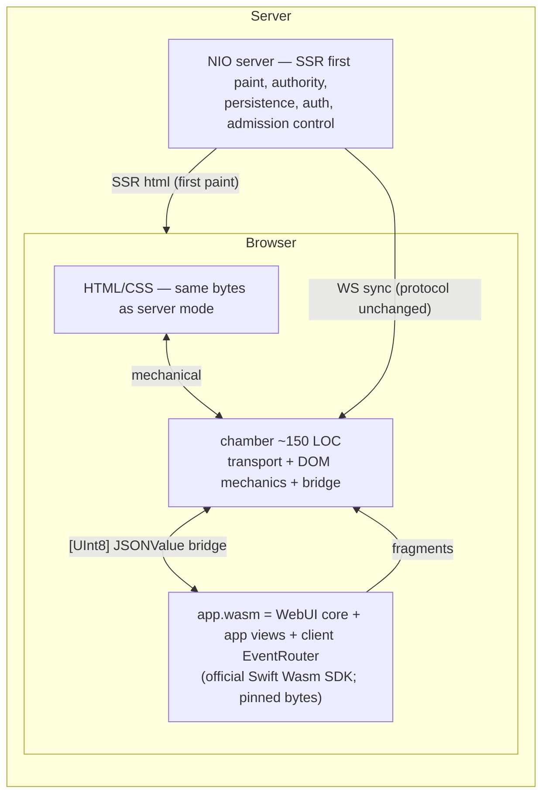

# no-webui — Public API Surface Audit, Frontend Interaction Map, and WebAssembly Rearchitecture Trajectory

_author: swift-dev (hermes agent) · date: 2026-09-15 · project: `no-webui` (this checkout) · status: design/plan — no code changed, nothing committed_

## 0. Executive summary

no-webui is a **server-rendered SwiftUI-for-web stack**: Swift value types render HTML
strings; a hand-written, deliberately static JavaScript runtime (`designer/assets/webui-runtime.js`)
captures DOM events, ships them over a WebSocket, and applies server-computed HTML
fragments. The client is a dumb, static receiver by design: every interaction is a
network round-trip; the client holds no logic, no data, and no renderer.

The goal this document serves: **make the runtime more flexible and move server
rendering load onto the client** — without breaking the framework's zero-dependency
religion or its security invariants.

The thesis, upheld through every outline item below:

> **Move the rendering brain into the browser as the exact same compiled Swift.**
> The `WebUI` render core and `EventRouter` have zero OS dependencies already; they
> can build with the **official Swift Wasm SDK** (swift.org — Apple Open Source
> Program Office distribution; **not** a dependency under no-webui's rule) and
> execute in the page through a **hand-rolled narrow bridge** (no JavaScriptKit, no
> npm WASI shims — the third hand-rolled interop layer in this codebase, after the
> JSON codec and Base64). The JS runtime stops being the *brain* and becomes a
> mechanical transport: capture → call into wasm → apply returned fragments. The
> server stops being the *per-interaction renderer* and becomes authority,
> persistence, and first paint.

Constraint honored throughout: **zero third-party dependencies.** Permitted:
Swift Wasm SDK, stdlib (`Synchronization`, `_Concurrency`, `@TaskLocal`), swift-log —
all Swift project / Apple. Excluded: JavaScriptKit, npm WASI shims. The bridge uses
official compiler primitives (`@_expose(wasm)` / `@_cdecl`) plus browser platform
APIs (WebAssembly JS API, DOM, WebSocket).

Owner decisions already locked (see §0.1 for the full log, including the
`@TaskLocal`/swift-log contingency):

- the dependency rule is untouched; the official Wasm SDK is not a dependency;
- the JS runtime may stay exactly as dumb and static as it is today — what changes
  is *where the event handler is implemented* (a direct call into wasm memory
  instead of a WebSocket to NIO);
- `@TaskLocal` and swift-log survive **if they survive the wasm/embedded subset**;
  if they cannot survive for a technical reason they are **thrown out** and
  breaking API changes are accepted — no design in this document is hostage to
  either.

### 0.1 Decision log

| # | Decision | Owner | Status |
|---|---|---|---|
| D1 | Official Swift Wasm SDK only; hand-rolled narrow bridge. JavaScriptKit / npm WASI shims are out (they are dependencies). | user | locked |
| D2 | The render brain moves into wasm (same Swift); JS stays mechanical; server is authority + SSR first paint. | user | locked |
| D3 | `@TaskLocal` (RenderContext) and swift-log (`Logger`) are keep-if-they-survive. If they do not compile under the wasm/embedded subset, throw them out — breaking changes accepted. No hostage design. | user | locked — verdicts resolved 2026-09-15 (see `WASM_SUBSET_AUDIT.md`): `@TaskLocal` keeps on full; swift-log keeps on full / `LogFunnel` for the embedded tier |
| D4 | Credential verification, Argon2, throttling, and session authority never move to the client. Client wasm is advisory UI-gating only. | user | locked |
| D5 | The WS wire protocol (`WSIncoming`/`WSOutgoing`) stays byte-compatible; `FragmentUpdate` becomes the universal patch envelope in both directions; no transmitted-code message type is ever reintroduced. | design | locked |

---

## 1. Scope, method, and verified source facts

### 1.1 Method

- Public surface extracted mechanically from source: **224 type-level declarations**
  and **800 member-level declarations** across `Sources/WebUI*` (grep of `public`
  at file scope, `total_count` from tool output, verified against the current
  checkout).
- The complete client contract read in full: `designer/assets/webui-runtime.js`
  (925 lines) and the CSS surface (`designer/assets/design-system.css`, 8,449
  lines → 290 `:root` tokens, 1,649 unique top-level classes, 22 styled component
  families).
- Interaction-bearing Swift files read in full or in targeted passes:
  `HTMLDocument.swift`, `EventHandling.swift`, `WebSocketProtocol.swift`,
  `WebUIRuntime.swift`, `RuntimeConfig.swift`, `View.swift`, `ModifiedView.swift`,
  `Dismissible.swift`, `Observable.swift`, `JSONValue.swift`, `ConnectionGate.swift`,
  `Crypto.swift`, `Base64.swift`, `ConstantTime.swift`, `Icon.swift`, `Tokens.swift`,
  `Utilities.swift`, `CSSMinify.swift`, `CSSRule.swift`, `Primitives.swift`,
  `Layouts.swift`, `Modifiers.swift`, `ViewBuilder.swift`, `WebUIDocument.swift`,
  `WebUITheme.swift`, `DesignSystemAssets.swift`, `WebUIComponents.swift`,
  `Chart.swift`, `ChartCore.swift`, `ChartMarks.swift`, and every `WebUIAuth/*`
  protocol, model, and store file.
- Cross-checks against project memory: `no-webui/AGENTS.md` conventions,
  `swift-web-ui` skill (architecture + pitfalls), and this workspace's AGENTS.md.

### 1.2 Verified facts that anchor every design decision

| Fact | Source |
|---|---|
| `View` is `func render() -> String`, pure, `Sendable`, no OS coupling | `Sources/WebUI/View.swift:4` |
| `EventHandler = @Sendable (EventData) async -> [FragmentUpdate]` | `Sources/WebUI/EventHandling.swift:24` |
| `EventRouter` locks state with `Synchronization.Mutex`; positional ids `c0…`/`e0…`; `maxHandlers` 10 000 cap | `Sources/WebUI/EventHandling.swift:27-123` |
| `RenderContext` is `@TaskLocal`; `controlAttributes(id:event:handler:)` re-emits stable ids **without** re-registering when no `RenderContext` is present | `Sources/WebUI/EventHandling.swift:126-160` |
| JSON codec is hand-rolled over `[UInt8]` (no `Foundation.Data`), recursion-cap 128; `WSMessageError.malformed` | `Sources/WebUI/WebSocketProtocol.swift`, `Sources/WebUI/JSONValue.swift` |
| `HTMLDocument` mints a random CSP nonce per init; prod CSP is nonce-only (`script-src 'nonce-…'`, **no** `unsafe-eval`); dev CSP is `'unsafe-inline'`; `preMinifiedStyles` hoists the 300 kB sheet | `Sources/WebUI/HTMLDocument.swift:24-41,18-23` |
| `WebUIRuntime.bootstrap(config:)` → `WebUIRuntime.init({…})` with only-set keys, hand-rolled JSON; `source` is the embedded JS | `Sources/WebUI/WebUIRuntime.swift`, `Sources/WebUI/RuntimeConfig.swift` |
| Runtime `DEFAULTS`: ws reconnect exp-backoff ×jitter (max 30 s), ping 30 s / pong 60 s, input debounce 300 ms / max-wait 1000 ms, optimistic settle 5000 ms, queue cap 1000, logLevel warn | `designer/assets/webui-runtime.js:5-16` |
| `EVENT_TYPES` = 15 delegated events; input debounced; others immediate; `focus`/`blur` normalized via `focusin`/`focusout`; `data-event` filter drops undeclared events | `webui-runtime.js:19,227-286,408-443` |
| FragmentPatcher: `outerHTML` replace, monotonic `seq` ordering, optimistic arm/pending/rollback, input/scroll/focus save-restore | `webui-runtime.js:452-699` |
| Client sanitizers: parse-then-sanitize fragment scrub (remove `<script>`, strip `on*`, denylist URL attrs on real nodes), `stripUrlControlChars` + protocol denylist for URLs, prototype-pollution deny in the state store | `webui-runtime.js:509-542,702-710,733-802` |
| Router navigate/redirect/reload; `popstate` → `navigate` message; offline `messageQueue` replays on `onopen`; `renderToken` attached to every event/ping | `webui-runtime.js:712-731,884-887`, `WebSocketProtocol.swift:15` |
| Native form POST happens only when the form has **no** `[data-component-id]` ancestor (delegator early-returns) | `webui-runtime.js:234-242` |
| WS upgrade gate: GET + `/ws` + `Origin==Host`; per-event session re-check; `Cache-Control: no-store`, `X-Frame-Options: SAMEORIGIN`, `nosniff` server-side | `Sources/WebUIAuthExample/MainProgram.swift` + `references/frontend-auth-adversarial-pass.md` |
| Chart rendering is pure SVG strings + `aria` labels; mark selection routes through typed `ChartSelectHandler (ElementRef, String)` | `Sources/WebUIChart/Chart.swift:156`, `ChartCore.swift:423` |
| CSP `'wasm-unsafe-eval'` is **required** in `script-src` for `WebAssembly.instantiate/compile` under a strict policy (else `EvalError`) | MDN `script-src` (2026-08-12), W3C WebAssembly content-security-policy proposal |

### 1.3 Current architecture (baseline)

```mermaid
flowchart LR
    subgraph Browser
        DOM[HTML + CSS<br/>SSR bytes from server]
        JS[webui-runtime.js<br/>WSClient | EventDelegator | FragmentPatcher<br/>Router | StateStore | sanitizers]
        DOM <--> JS
    end
    JS -- "WS: event / ping / navigate (+renderToken)" --> SRV
    SRV[Swift process: NIO server<br/>EventRouter | handler closures | render()<br/>auth | CSRF | sessions]
    SRV -- "WS: update / redirect / state / reload / error / pong" --> JS
    SRV -- "fragment html" --> JS
```

The server renders every page and every fragment; the client is a thin,
intentionally-dumb patcher. The one piece of hand-written logic in the client is
`webui-runtime.js`, and it is static by construction because it *can't* be anything
else — there is no client brain to drive it.

---

## 2. Outline of the entire public API surface — per item: JS interaction → redesign

Each section has the structure the user asked for:

- **Surface** — the public API, verified from source.
- **JS interaction (as-is)** — exactly how the runtime / frontend touches it today,
  with file:line anchors where useful.
- **Redesign** — the target design relating **SP** (Swift process(es)), **JS**, and
  **HC** (HTML/CSS), always under §0's thesis.

Client renderer = "the same `WebUI` core compiled with the official Swift Wasm SDK".
"the bridge" = the hand-rolled narrow Swift↔JS bridge (§3.2). "server mode" = today's
architecture. "client mode" = new target. "static mode" = `includeRuntime:false`
documents (export/print/SEO).

### 2.0 Render modes & placement matrix (at a glance)

| Outline group | Server mode (today) | Client mode (target) | Static mode |
|---|---|---|---|
| View core, primitives, layouts, CSS, tokens, icons | render in NIO, bytes over HTTP | render in wasm, patch via bridge; byte-identical to SSR | render once, no runtime |
| Event modifiers, EventRouter, RenderContext, controlAttributes | router in NIO; WS round-trip per event | router in wasm; local dispatch; WS sync for authority | no handlers (warn-and-drop) |
| ElementRef / Dismissible / typed controls (table, pagination, chart) | refs resolve server-side | refs resolve in wasm; same typed handlers | refs inert (no context) |
| WebSocket protocol / FragmentUpdate | canonical wire | same wire; wasm is a producer *and* consumer | absent |
| HTMLDocument / WebUIDocument | runtime inline, nonce CSP | client boot (wasm loader), CSP + `'wasm-unsafe-eval'` | deterministic assembly (`emitNonce:false` style) |
| Design system / theme / assets | CSS bytes embedded + minified | same bytes embedded; wasm + loader added | same bytes, no runtime |
| Chart | pure SVG server-side; selection via WS | pure SVG computed in wasm; selection local; windowing local | pure SVG, no interaction |
| Auth (all) | server authority | **stays server**; wasm mirrors only session-presence for UI gating | — |

---

### 2.1 `WebUI` core (§2.1 covers `Sources/WebUI/*`)

#### 2.1.1 View / ViewModifier / ModifiedView / AnyView / EmptyView

**Surface.** `protocol View: Sendable { func render() -> String }`; `protocol
ViewModifier: Sendable { func apply(to html: String) -> String }`; `ModifiedView
<Content: View, M: ViewModifier>` (concrete type preserved through the chain);
`AnyView` (erasure); `EmptyView`.

**JS interaction (as-is).** None directly — this layer only produces HTML strings
that flow into `HTMLDocument.body`. An element becomes JS-visible *only* when a
modifier or component emits `data-component-id`/`data-event`.

**Redesign.** This layer *is* the client renderer core; it is already wasm-clean
(pure String algebra, no OS surface). No API change. One addition, additive to
`View`:

```swift
// target
public protocol View: Sendable {
    func render() -> String
}

// new, default-implemented, additive:
public extension View {
    /// render a stable-id keyed fragment for client-side patching.
    /// default = render() unchanged; components with typed controls override
    /// to emit the stable control ids via controlAttributes.
    func renderFragment(id: String) -> String { render() }
}
```

**SP** — `render()` runs in NIO (server mode) and in wasm (client mode); **JS** —
receives fragment HTML from whichever host produced it, patches identically; **HC** —
byte-identical output for the same state (enforced by the existing byte-identity
gates, which extend to the wasm output unchanged). Hydration rule: client-computed
HTML must byte-match SSR for the same state, so the patcher never sees a surprise.

#### 2.1.2 ViewBuilder

**Surface.** `@resultBuilder` over `[any View]`: `buildBlock` (variadic +
single-view overloads), `buildExpression` (single + array), `buildOptional`,
`buildEither(first:)`/`buildEither(second:)`, `buildArray`, `buildLimitedAvailability`.

**JS interaction.** None. Pure compile-time overload resolution.

**Redesign.** Unchanged — pure compile time with no runtime features, so it
compiles identically in the wasm/embedded subset. No work.

#### 2.1.3 Primitives — Text, Raw, Div, Span, Button, Input, Image, Link, Heading, Paragraph, UnorderedList, OrderedList, Table, SelectOption, Label, TextArea, Select, ForEach, Group, Form

**Surface.** Value-type HTML elements with `id`/`class`/generic attributes;
`Button.ButtonType` (button/submit/reset); `Input.InputType` (17 types); `Image`
(`loading`/`decoding`), `Link` (`LinkTarget`, `LinkRel` option set) — all
URL-accepting parameters through `sanitizeURL`; `Heading`/`HeadingLevel`; `Table`;
`Select`/`SelectOption`; `TextArea`; `ForEach<Data: RandomAccessCollection &
Sendable>` over `@Sendable (Data.Element) -> [any View]` closures; `Group`
(transparent container); `Form(action:method:csrfToken:)`.

**JS interaction (as-is).** Inert primitives never touch JS. Three interaction
channels exist:
- **Native form POST.** A `Form` whose subtree carries no event-handler modifier
  renders no `data-component-id`; the delegator's `findComponent` early-returns
  (`webui-runtime.js:234-242`) so the browser performs a native
  `application/x-www-form-urlencoded` POST carrying `_csrf`. If a handler *is*
  present, `submit` is prevented and the event rides the WS (with the full form
  serialized in `extractFormData`).
- **Click interception.** On `click`, if the target is inside an `<a>`, the
  delegator prevents default (unless `download`/`#hash`/`target="_blank"`), so link
  navigation flows through the server / router instead of the browser.
- **Payload shapes** (`extractEventData`): click → `{targetId, targetClass}`;
  input/change → `{value}` or `{value, checked}`; submit → serialized form;
  keyboard → `{key, ctrlKey, shiftKey, altKey, metaKey}`; focus/mouse → `{}`.
  Select-multiple joins with commas; file inputs are dropped.

**Redesign.** Keep primitives as the shared markup core for both hosts. Stepwise,
breaking-tolerant per house policy:
- **Typed client value contracts.** `Input`, `TextArea`, `Select` gain an optional
  `ClientValue` binding so `.onInput`/`.onChange` handlers in client mode receive
  structured values directly (search term, numeric filter, row id) rather than
  `[String: String]`. The wire effect is *zero on the happy path* — the value never
  leaves the wasm heap unless the handler forwards it. **JS** — only marshals a
  small `{name, value}` through the bridge (no logic); **HC** — a `data-value`-style
  attribute carries the current value from renderer to the capture shim so a
  patch never loses the live input (replacing the value save/restore dance with a
  render-time echo).
- **Client-side validation.** A `Validator` result builder on `Form` (pure closure
  constraints, compiled both hosts). Server re-validates on submit — same code,
  authority unchanged. **JS** — zero new logic; wasm sets
  `setCustomValidity`/`reportValidity` via a bridge import.
- **Native POST rule** is preserved bit-for-bit: static/SSR pages keep native
  submits; client-mode forms still early-return on no `data-component-id` and
  dispatch through the local router when handlers exist.

#### 2.1.4 Layouts — VStack, HStack, ZStack, Spacer, ScrollView, Grid, Section, Navigation, Header, Footer, Main, Aside

**Surface.** Flexbox/grid wrappers (`LayoutStyles` classes: `.vstack`, `.hstack`,
`.zstack`, `.zstack > *`, `.spacer`, `.scrollview`, `.grid`); `GridColumns`
(equal/fixed/auto/manual); semantic HTML5 (`Section`/`Navigation`/`Header`/`Footer`/
`Main`/`Aside`).

**JS interaction (as-is).** None — pure CSS classes + structure. `ScrollView` (and
arbitrary scrollable containers via the `div, section, ul, ol, main, aside, nav,
[tabindex]` heuristic) participate in the FragmentPatcher's input-state
save/restore (`webui-runtime.js:589-594`).

**Redesign.** Unchanged — pure `render()`, shared core. Scroll survival stays a JS
mechanical duty (it must read/write *live DOM state*; wasm cannot own it). Both
hosts emit identical class names by construction (shared core + shared stylesheet).
No work.

#### 2.1.5 Modifiers — styling chain + attributes + showIf + event modifiers + optimistic click

**Surface.** `InlineStyle`/`CSSProperty`, `HTMLAttribute`, `ComposedModifier`,
`NoopModifier`, `AnyViewModifier`; the fluent chain (`backgroundColor`,
`foregroundColor(_:)` two overloads, `font(size:weight:)` two overloads,
`fontFamily`, `textAlign(_:)` two overloads, `padding(_:)` ×3, `margin`,
`width`/`height`/`maxWidth`, `display`, `flex`, `border`, `cornerRadius`,
`showIf(_:)`); identity/attr modifiers (`id(_:)`, `class(_:)`,
`attribute(_:_:)`); **event modifiers** — `onClick/onSubmit/onInput/onChange/
onFocus/onBlur/onKeyDown/onKeyUp/onKeyPress/onMouseDown/onMouseUp/onMouseOver/
onMouseOut/onFocusIn/onFocusOut` (all taking `@escaping EventHandler`) plus
`onOptimisticClick(predict:perform:)` and the stable-id variant
`onClick(id:perform:)`; `HTMLEvent` enum; `EventHandlerModifier` +
`StableIDEventHandlerModifier`.

**JS interaction (as-is).** This is where the runtime contract is minted:
- each event modifier emits `data-component-id` + `data-event` on the wrapped
  element; the delegator delivers **only** the declared event type
  (`effectiveTypes` normalizes `focusin`→`focus`, `focusout`→`blur`); a click-only
  component never hears hover noise — `webui-runtime.js:227-242`.
- keyboard payload = `{key, ctrlKey, shiftKey, altKey, metaKey}`; Enter on
  non-editable targets prevent-defaults unless `data-prevent-enter="false"`.
- **`onOptimisticClick`**: the server bakes a `data-optimistic` JSON array of the
  *predicted fragments* onto the element at render time; on click the delegator
  parses and applies them immediately (`applyPrediction` → patcher `patch(…, true)`
  → `armPending` saves `outerHTML`); if no authoritative `update` for that id lands
  within `optimisticSettleMs` (5 s), the patcher rolls back to saved HTML.
- `RuntimeConfig` knobs tune debounce and settle from Swift.

**Redesign.** This is the layer with the most logic in JS today, and the exact
layer that should become Swift:
- **`OptimisticClickModifier` becomes client-first.** The prediction closure runs
  *in wasm* — a pure function of current client state; the resulting fragments are
  applied via the patcher import. Rollback is wasm-computed by re-rendering from
  the last-acknowledged state. JS keeps only the mechanical `arm`/`commit`/`rollback`
  primitives (timers + outerHTML swap), not the prediction logic. `settleMs` becomes
  a wasm-side state-retention policy (Knob D3, see `RuntimeConfig` §2.1.11);
  `data-optimistic` stays for server mode so existing pages/gates are untouched.
- **Event payload widening** lands here as the single seam: `EventHandlerModifier`
  produces `EventData` whose `data` field is a `JSONValue` (from §2.1.6) instead of
  `[String: String]`. Breaking but contained; the wire shape for server mode
  remains `{… data: …}` so old runtimes and servers stay interoperable.
- **JS** shrinks to: capture → build a minimal `{event, targetId, value}` envelope
  → bridge-call `handleEvent(bytes)` → take returned fragments → patch. All *policy*
  (modifier-filter, focus normalization, preventDefault rules) can remain in JS as
  DOM mechanics — zero churn, existing pins keep passing.

#### 2.1.6 Event system — ComponentID, EventData, EventHandler, EventRouter, RenderContext, controlAttributes

**Surface.** `ComponentID` (String, `ExpressibleByStringLiteral`, `Codable`);
`EventData.component/event/data`; `EventHandler`; `EventRouter` (`register`,
`nextComponentID`, `nextElementID` — separate `e0…` counter, `handlerCount`,
`handle(_:)`, `reset()`, `maxHandlers` cap, `Synchronization.Mutex`-guarded state,
`observers`/`logger`); `RenderContext` (struct with `@TaskLocal static var
current`); free `controlAttributes(id:event:handler:)` — register-once-at-page-build,
re-emit-stable-id-without-register when no context (the mechanism that keeps typed
controls routable across fragment re-renders).

**JS interaction (as-is).** `data-component-id` is the single rendezvous key. The
delegator walks `composedPath()` (depth-capped at 20) to the nearest
`[data-component-id]`, falls back to `label[for=id]` association, then emits
`{type:"event", component, event, data, token}` (token = render token). Server-side
the router maps id → handler; handler runs; fragments return. The **render-once
per-page + one-router** invariant (§AGENTS) is the server's rule.

**Redesign — the pivotal move.** The router/context machinery is already
OS-free, `Sendable`, and `Mutex`-backed:
- The **page's router becomes a resident object inside the wasm heap** in client
  mode. A single export `webui_handle_event(bytes) -> bytes` decodes a JSONValue
  `EventData`, routes through the client-resident `EventRouter`, runs the async
  handler (driven by the pump, §3.3), and returns the produced fragments. The JS
  chamber just calls it.
- The **server router exists only** for (a) events the client explicitly forwards
  (handlers that need server data call `wsSend`), and (b) pages rendered in server
  mode. Both routers are the *same type*; a page declares its mode at boot
  (`WebUIDocument(clientMode:)`).
- **Stable-id contract is unchanged** — `controlAttributes` compiles into wasm with
  identical semantics; fragment re-renders produced in wasm carry the same stable
  `data-component-id`s; routing stays alive across local patches exactly as it does
  across server patches today.
- **D3 contingency (`@TaskLocal`).** `RenderContext` uses `@TaskLocal`. If the
  wasm/embedded subset rejects it for a technical reason, the throw-out path is
  defined: on single-threaded client builds an **ambient context** (a guarded
  module-level context slot, reset per top-level event) is trivially correct because
  there is exactly one task at a time — `@TaskLocal` was never load-bearing for
  correctness there, only for re-entrancy hygiene. The public surface
  (`RenderContext.$current.withValue`, `controlAttributes`) is kept by routing the
  ambient through the same API, so consumer code does not change. In the full-stdlib
  wasm build, `@TaskLocal` is kept if it survives. Either way: **no hostage.**

#### 2.1.7 Element refs & dismissal — ElementRef, DismissHandler, Dismissible, Dismissal

**Surface.** `ElementRef` (`Sendable`, `Hashable`; `static func stable(_ id:)` —
framework-facing factory; `remove() -> FragmentUpdate` (terminal);
`replace(with html:)`; `update<V: View>(_ view:)`); `DismissHandler = @Sendable
(ElementRef, EventData) async -> [FragmentUpdate]`; `Dismissible: View` protocol
(`dismissButtonClass`, `dismissMarker`, `dismissRootIdentifier`, `var onDismiss:
DismissHandler?`); `Dismissal`; fluent `.onDismiss`.

**JS interaction (as-is).** The framework mints a component id for the dismiss
control at page build, registers the handler capturing the ref, and the control
carries `data-component-id`/`data-event`; clicks route through the delegator like
any control. `remove()` produces an empty fragment; the patcher's
`!fragment.firstChild` branch removes the element (`webui-runtime.js:553-556`) —
the pinned empty-fragment-removes-element behavior.

**Redesign.** Unchanged API, re-seated execution. In client mode the `ElementRef`
ops become *local wasm computations*: `remove()` → bridge import
`removeElement(id)`; `update(_:)` → render-in-wasm then patch via the patcher
import; `replace(with:)` → direct patch. Terminal-removal semantics stay pinned by
the existing tests, which are host-agnostic because they assert on generated
fragment HTML. JS: no change beyond the mechanical patch removal it already does.

#### 2.1.8 WebSocket protocol — FragmentUpdate, WSIncoming, WSOutgoing, codecs

**Surface.** `FragmentUpdate(id: String, html: String)` (`Codable`, `Hashable`);
`WSIncoming` — `.event(component:event:data:token:)`, `.ping(token:)`,
`.navigate(url:)` (hand-decoded, `WSMessageError.malformed` on unknown type);
`WSOutgoing` — `.update(fragments:seq:)`, `.redirect(url:replace:)`,
`.state(path:value:)`, `.reload`, `.error(code:message:)`, `.pong`
(hand-encoded); the `[UInt8]` codec: `init(jsonBytes:)`/`init(jsonText:)`,
`jsonText`/`jsonBytes`.

**JS interaction (as-is).** This *is* the wire contract the runtime implements:
`createMessageDispatcher` is an exact mirror of `WSOutgoing` (update/redirect/
state/reload/error/pong), and the delegator produces the `WSIncoming` shapes. `seq`
monotonicity guards against duplicate/out-of-order patches
(`webui-runtime.js:461-467`); `token` binds a page render to a session and lets
revocation kill stale pages (router keyed by `session → [renderToken: router]`).

**Redesign.** The protocol is **untouched** — the sync channel for client mode, and
byte-identical for server mode. Two additive affordances, nothing removed:
- `FragmentUpdate` becomes the **universal patch envelope in both directions**
  (client→server for optimistic/local-first sync using the same `seq` discipline;
  server→client for authority). No new message types required; the direction is a
  transport property, not a protocol change.
- The wasm producer serializes with the *same* hand-rolled codec, so a client-mode
  page and a server-mode page are interchangeable on the wire — a client-mode page
  can even be "promoted" to server rendering by a load balancer without any
  protocol negotiation.
- The `script`-message ban remains load-bearing in server mode and is structurally
  satisfied in client mode (§3.7). **Nothing in this protocol becomes code.**

#### 2.1.9 JSONValue — the hand-rolled rfc 8259 codec

**Surface.** `enum JSONValue` (object/array/string/number/bool/null; `Equatable`,
`Sendable`); `parse(_:) throws`, `serialize()`, `escapeString(_:)`; `JSONError`
(nesting-depth cap 128 → `nestingTooDeep`).

**JS interaction (as-is).** Server-side decode of every `WSIncoming`; used by
`RuntimeConfig.encodedJSON()`; recursion-capped to close the 5-k-deep stack-bomb.

**Redesign.** Unchanged and **load-bearing for the whole trajectory**: this is the
one JSON dialect that survives Embedded Swift (no Codable, no `Foundation.Data`),
so it *is* the bridge marshal format (§3.2). It compiles into wasm as-is. Two
small, non-breaking extensions to consider later: a `write(into: inout [UInt8])`
streaming serializer and an ordered-object variant for byte-stable patches. No
behavior change now; existing depth-cap tests stay.

#### 2.1.10 HTMLDocument — full-page assembly, CSP, runtime embedding

**Surface.** `HTMLDocument(title:body:styles:rawStyles:scripts:head:bodyAttributes:
devMode:lang:includeRuntime:runtimeConfig:contentSecurityPolicy:
preMinifiedStyles:)`; per-init `nonce` (16 random bytes, base64url, fail-loud on
entropy failure); `effectiveCSP(nonce:)` — prod `default-src 'self'; script-src
'nonce-…'; style-src 'self' 'unsafe-inline'; img-src 'self' data:; connect-src
'self' ws: wss:`; dev `'unsafe-inline'`; `render()` assembles DOCTYPE + CSP meta +
style tag (minified or pre-minified) + runtime/app inline script(s) carrying the
nonce.

**JS interaction (as-is).** This is the **boot boundary**:
- prod: `WebUIRuntime.source` (925 lines) + `WebUIRuntime.bootstrap(config:)` are
  inlined into one `<script nonce="…">` (single nonce per page load);
- dev: `<link href="/ui/styles.css">` + `<script src="/ui/scripts.js">` +
  `<script src="/ui/app.js">`;
- the default CSP gates everything the runtime can do; `connect-src 'self' ws:
  wss:` allows the WebSocket, nonce gates inline scripts, no `unsafe-eval` anywhere
  in prod.

**Redesign.** Evolve the boot boundary into a **client-mode boot**, additive to the
existing modes:
- `HTMLDocument` gains `clientMode: ClientBoot = .none`. `.none` is bit-for-bit
  today. `.client(wasm:loader:)` emits the wasm loader glue + a reduced chamber
  script instead of (or alongside) the full runtime, and references the served
  `app.wasm`.
- **CSP change is mandatory and verified**: the prod nonce-only `script-src` blocks
  WebAssembly compilation (`EvalError` at `WebAssembly.instantiate`). Client-mode
  documents set `script-src 'self' 'nonce-…' 'wasm-unsafe-eval'` — still `'self'` +
  nonce, still no `'unsafe-inline'` in prod, `img-src`, `style-src`,
  `connect-src` unchanged. Pin test added beside the `effectiveCSP` assertions.
- **wasm delivery**: serve `app.wasm` as a first-class static asset. The
  `WebUIAssetPlugin`/serve pipeline grows a wasm product (`WebUIAssets.wasm:
  [UInt8]` + a loader string) following the exact house pattern (§2.2.4). Separate
  `.wasm` file (cacheable, not base64-bloated) is the default for internal apps;
  byte-embedding remains available for single-file/distributed pages.
- Dev mode gains `/ui/app.wasm` + `/ui/webui-client.js` script tags.
- `preMinifiedStyles` behavior is preserved; the wasm build embeds the same
  minified sheet bytes so the client can (if ever needed) hydrate standalone.

#### 2.1.11 WebUIRuntime + RuntimeConfig — the JS entry point and its knobs

**Surface.** `WebUIRuntime.source` (embedded JS), `bootstrap` (the literal
`WebUIRuntime.init();`), `bootstrap(config:)` (only-set keys, hand-rolled JSON);
`RuntimeConfig` fields: `wsUrl`, `wsReconnect`, `wsMaxReconnectDelayMs`,
`wsPingIntervalMs`, `wsPongTimeoutMs`, `maxQueueSize`, `debounceInputMs`,
`debounceMaxWaitMs`, `optimisticSettleMs`, `logLevel`, `renderToken`; `isEmpty`;
`encodedJSON()`.

**JS interaction (as-is).** `init(opts)` merges `DEFAULTS`; config flows into
WSClient/EventDelegator/FragmentPatcher; `renderToken` is echoed with every
event/ping and is the auth binding that lets a session revoke stale pages.

**Redesign.** `WebUIRuntime` becomes the **bootstrap of the client brain**, not the
brain itself:
- New `WebUIClient` module (wasm) exposes the export/import surface of §3.2.
  `WebUIRuntime.bootstrap` gains a `clientMode` variant that emits
  `WebUIClient.boot({config})` glue when the page owns a client binary — and
  degrades to the current runtime on `.none`. Server-mode bytes stay identical
  (every string pin and smoke gate keeps passing).
- **Knob split (behavior vs transport)**: transport knobs (ws, reconnect, ping,
  queue, renderToken) stay JS-owned where they are today; behavior knobs
  (`debounceInputMs` → wasm scheduling hint, `optimisticSettleMs` → wasm state-
  retention policy, `logLevel` → bridged `Logger` level) move to Swift semantics
  and are channeled through the bridge. Old keys remain accepted (ignored) so a
  client-mode page can be reverted by only changing the boot flag.

#### 2.1.12 CSS system — rules, media, keyframes, fonts + minifier

**Surface.** `CSSDeclaration`, `CSSRule`, `CSSStylesheet`, `CSSMediaQuery`,
`CSSKeyframes`, `CSSFontFace`; `LayoutStyles` static rules; `generateSpacingClasses`,
`generateAlignmentClasses`; `minifyCSS(_:)`.

**JS interaction (as-is).** None — CSS compiles into the `<style>` tag; the runtime
never reads styles. The 300 kB design sheet ships pre-minified via
`preMinifiedStyles`.

**Redesign.** Unchanged semantics; becomes shared core (compiles to wasm so
client-rendered fragments reference the same classes — a hard requirement of the
byte-identical hydration rule). `minifyCSS` must stay deterministic across hosts
(it is — pure string rewriting). The wasm build embeds the same minified sheet
bytes (asset tool output) so client-mode pages could, in principle, ship fully
standalone. JS: no involvement either way.

#### 2.1.13 Tokens — SpaceToken, ColorToken

**Surface.** `SpaceToken: Int, CaseIterable` (`cssVariable` → `--space-N`);
`ColorToken: String, CaseIterable` (`cssVariable` → kebab) — names only; **no Swift
type holds token values** (values live solely in `design-system.css`, the shipped
asset).

**JS interaction (as-is).** None directly; token names appear in inline styles the
patcher replaces wholesale.

**Redesign.** Unchanged. The name-only invariant extends to the client build
unchanged. If a client-computed style ever needs a raw value, it is derived at
build time into `DesignTokens+Generated.swift` (the existing derived-constants
design in `references/export-architecture.md`) — never hand-mirrored. No JS.

#### 2.1.14 Utilities — escaping, attribute injection, markdown, code highlight, URLs, CSRF

**Surface.** `htmlEscape` (single-pass, fast path), `injectAttributes`,
`markdownToHTML`, `highlightCode`, `inlineSVG`, `sanitizeURL` (browser-parity:
strip c0/ascii-whitespace then scheme denylist), `attrIf`/`classIf`;
`CSRFProtection` — `generateSecret() throws`, `token(for:secret:maxAge:) throws`
(default TTL 30 min), `validate(_:for:secret:) -> Bool` (false on signing failure),
`expiry(of fixed:)`; `CSRFError`.

**JS interaction (as-is).** The *same* URL rule set is mirrored in JS
(`isSafeUrl`/`stripUrlControlChars`, `webui-runtime.js:702-710`) for
navigate/redirect and the fragment sanitizer. CSRF tokens render as hidden form
inputs consumed only by a native form POST (or a same-origin `fetch` the server
route accepts). Escaping is server-side entirely.

**Redesign.**
- **URL policy single-sources in Swift.** Both sides already implement the same
  strip-then-deny algorithm; the only drift surface is two literals. With a client
  brain, `sanitizeURL` executes *in wasm* before any fragment is patched or any
  navigation is issued from client code; the JS copy is retained only as the
  mechanical pre-pass on untrusted socket data (defense in depth, same bytes as
  today). Add one shared fixture table (the obfuscation payload table from
  `references/web-framework-hardening-audit.md`) driven against *both* sides in CI.
- **CSRF stays server-side and unchanged.** Client mode adds nothing here: forms
  that need a same-origin fetch receive the token at render time and thread it
  through the bridge without JS logic.

#### 2.1.15 Crypto/security helpers — HMAC, SecureRandom, constantTime, Base64, ConnectionGate

**Surface.** `HMACSHA256.authenticate(message:with:) throws`, `.hex(message:key:)`,
`.hex(message:String,key:String)`; `SecureRandom.bytes(_:)-?` (fail-loud at
callers); `bytesToHex`; `constantTimeEquals` (generic `Sequence`); `Base64`
(encode/encodeURL/decode/decodeURL — all `[UInt8]`); `ConnectionGate` (`maximum`,
`tryAcquire`, `release`, `activeCount` — concurrency-limited admission).

**JS interaction (as-is).** None — pure server-side primitives underpinning
tokens, cookies, CSRF, and admission control.

**Redesign.** **No movement. D4 applies.** These stay in the authority plane. The
client bridge never performs credential cryptography with client-held secrets;
session *presence* checks in wasm (for UI gating) read only the server-issued
render/session handle. `ConnectionGate` remains server admission control (it
would be user-bypassable on the client by definition).

#### 2.1.16 Observability — ObservableEvent, Observable, ObserverList, Logger funnel

**Surface.** `ObservableEvent` (`viewRendered`, `eventReceived`, `eventHandled`,
`fragmentSent`, `websocketConnected/Disconnected/Error`, `error`, `debug`; Codable);
`protocol Observable` (`observe(_:)`); `ObserverList` (`maxObservers` 100,
identity-dedup, snapshot delivery, `Mutex`); `Logger.emit(event:observers:)` — the
unified funnel every emission routes through.

**JS interaction (as-is).** The runtime dispatches `webui:connected` /
`webui:disconnected` CustomEvents and console-logs; there is **no** observability
channel from the client back into Swift today. Server observers see only
server-side lifecycle.

**Redesign.**
- In client mode, add a bridge transport so `Logger.emit` events produced *inside
  wasm* (`eventReceived`, `eventHandled`, `fragmentSent`) fan out to server
  observers over the existing WS — a low-frequency telemetry message reusing the
  `ObservableEvent` Codable shape. Monitoring parity across hosts, zero new
  dependencies, and no JS logic (the chamber forwards bytes).
- **D3 contingency (swift-log).** `Logger` appears on `EventRouter`,
  `ObserverList`, and the design-system targets, all through swift-log. If
  swift-log does not compile under the wasm/embedded subset, the throw-out path:
  replace the logging dependency with a minimal in-package `LogFunnel` protocol +
  a no-op/in-memory default conformer that satisfies the same call sites
  (`logger.emit`, `logger.warning`, `logger.debug`). The public surface of
  `EventRouter(logger:)`/`ObserverList(logger:)` keeps its shape (the parameter
  type changes once; breaking change accepted). If swift-log *does* compile, keep
  it. Either way: **no hostage design.**

#### 2.1.17 Icons — WebUIIcon, WebUIIconCustom, IconSanitizer, IconLibrary

**Surface.** `IconSize` (`small`/`medium`/`large`/`extraLarge` em multiples, `slot`;
`suffixClass`, `em`); `WebUIIcon(_:size:title:)` (inline `<svg stroke=
"currentColor">`); `WebUIIconCustom(name:body:size:title:)`; `IconSanitizer
.sanitize` — parse-and-reemit **allowlist** (only geometry elements `path/line/
circle/rect/polyline/polygon/ellipse` + geometry/stroke/fill presentation attrs;
self-closing, html-escaped; `script`/`foreignObject`/url-bearing/`on*` absent by
construction); `IconSizeModifier.iconSize(_:)` ×2; generated `IconLibrary`/
`IconName` (618 glyphs from `designer/icons/icon-manifest.json`, regenerated by
`WebUIIconPlugin` each build; `named(_:)`, `isKnown`, `init?(emoji:)`).

**JS interaction (as-is).** Icons render as inline SVG strings in HTML; no JS
involvement; the full-catalog round-trip test pins allowlist byte-identity.

**Redesign.** Unchanged — inline SVG is wasm-portable as pure String; the
allowlist sanitizer stays at render time (both hosts use the same
`IconSanitizer.sanitize` so client-computed SVG is byte-identical to SSR). Client
mode carries the same icon bytes because it renders the same views. No work beyond
shared core.

---

### 2.2 `WebUIDesignSystem` (§2.2 covers `Sources/WebUIDesignSystem/*` + `WebUIDesignSystemMacros`)

#### 2.2.1 WebUIDocument — the styled document

**Surface.** Full `HTMLDocument` passthrough plus `theme: WebUITheme`;
`static minifiedDesignStyles` (the shipped sheet minified once at load);
`render()` → complete styled document.

**JS interaction (as-is).** Identical to `HTMLDocument`'s — the boot boundary; the
minified sheet in one `<style>` is what the patcher lives inside.

**Redesign.** Mirror `HTMLDocument`'s `clientMode` (§2.1.10): `WebUIDocument
(clientMode:)` emits the wasm boot, keeps the pre-minified sheet byte-exact, and
keeps the `includeRuntime:false` static/export path untouched. The client build
embeds `minifiedDesignStyles` for hydration parity checks (same bytes, enforced by
gate).

#### 2.2.2 Theming — WebUITheme, @Theme macro, WebUIThemeProvider, ColorScheme, DesignToken (generated)

**Surface.** `WebUITheme(tokens:customTokens:scheme:rules:)` (`ColorScheme`:
standard/dark), `tokens: [DesignToken: String]`, `customTokens`, `scheme`, `rules`,
`.standard`, `isEmpty`, `overlaying(_:)` (dynamic accents over a static theme),
`stylesheet()`; `WebUIThemeProvider` (extension-macro-generated conformances);
`DesignToken` — 169 `:root` token names, **generated** by the asset tool every
build, pinned by an independent-parser integrity test; `@Theme` validates by
construction (leading-dot keys → compiler rejects unknown cases at the expansion
site); cascade trick: theme `:root` overrides append *after* the pre-minified sheet
in the same `<style>`; `.dark` declares `color-scheme: dark`; `.standard` emits
nothing → byte-identical document.

**JS interaction (as-is).** None. Pure CSS bytes with a deterministic cascade.

**Redesign.** Unchanged — theme is pure CSS, byte-identical in client mode (same
sheet, same cascade, same `DesignToken` generation). The `:root`-scoped-token
invariant (later `:root` overrides restyle `var(--…)` component tokens; they do not
touch selector-scoped vars) continues to hold for any client-computed style. The
shared-core move landed (p5-t7): `DesignToken` generates into
`WebUIDesignSystemCore` (`DesignTokens+Generated.swift`, wasm-clean) and
`WebUITheme`/`ColorScheme`/`WebUIThemeProvider` live in that target; the `@Theme`
macro stays in `WebUIDesignSystem`. `stylesheet()` determinism is pinned by the
core-reachability suite and the existing theme tests. JS: none.

#### 2.2.3 Components — the 22 styled families (incl. typed control handlers)

**Surface.** `WebUIButton` (variant/size/fullWidth/loading), `WebUIInput` (label/
helpText/state), `WebUICard`, `WebUIBadge` (variant/size/dot), `WebUIAlert`
(Dismissible), `WebUITabs` (`TabItem` id+label, active), `WebUIAvatar` (initials/
src/status), `WebUIProgress` (value 0…1, showLabel, size), `WebUISkeleton`
(variant/width/height/count), `WebUIToast` (Dismissible), `WebUIModal`
(Dismissible, title/footer), `WebUITable` — typed control handlers
(`TableSortHandler`, `TableSelectAllHandler`, `TableSelectRowHandler`,
`TableExpandHandler`; `onSort`/`onSelectAll`/`onSelect`/`onToggleExpand`;
`sortableColumns`, `rowIds`, `selectedRows`, `expandedRows`, `rowDetails`,
`EmptyState`, `Alignment`, `SortDirection`), `WebUIChip` (Dismissible),
`WebUIEmptyState` (icon/title/message/action), `WebUISpinner`, `WebUITooltip`
(position), `WebUIStat` (size/trend/compare/spark), `WebUIPagination`
(`onPageChange`/`onRowsPerPageChange`), `WebUITimeline` (orientation/status/
`Event`), `WebUITree` (`Node`, expanded/selected), `WebUIBreadcrumb`
(collapse/maxItems), `WebUIDescriptionList`.

**JS interaction (as-is).**
- **Dismissible components** (alert/toast/modal/chip): framework mints a component
  id + handler for the close control at page build; the control carries
  `data-component-id`/`data-event`; click → delegator → empty-fragment removal.
- **WebUITable**: sort headers, select-all checkbox, row checkboxes, expand
  toggles carry **stable** `data-component-id`s from `controlAttributes`; the
  server maps them to the typed handlers; re-rendered fragments re-emit identical
  ids, keeping routing alive across patches.
- **WebUIPagination**: prev/next/page buttons + rows-per-page select self-wire the
  same way; handler returns fragment updates that swap the surrounding container.
- WebUITree/WebUITabs are declarative-render today (active tab / expansion set come
  from render inputs, not client interaction).

**Redesign — the flagship client-mode capability.** All typed control handlers run
in wasm against a client-resident copy of the data: **client-side sorting,
filtering (local search), row selection, expansion, paging** — `render()` in wasm
produces the fragment; the bridge patches. `ElementRef` ops stay the same
(`me.replace(with:)`). This is the "local search" the static runtime cannot do,
made native, with zero new strings at the call site (the zero-string typed-handle
contract is preserved — the handles resolve differently but the API is identical).
- Server mode remains for datasets that must stay server-side; components are
  mode-agnostic because they only ever produce fragments + register handlers.
- Dismissible controls need zero change (already typed refs; empty-fragment
  removal is pinned).

#### 2.2.4 Assets — DesignSystemAssets, WebUIAssets (generated), asset pipeline

**Surface.** `DesignSystemAssets.minifiedCss`, `.prewarm()`; `WebUIAssets.css`,
`WebUIAssets.js` (generated by `WebUIAssetTool` into `.build/`, gitignored; the
build-tool plugin pattern: `WebUIAssetPlugin` runs every build, reads
`designer/assets/*`, emits the Swift constants).

**JS interaction (as-is).** `WebUIAssets.js` **is** the runtime; `.css` is the
sheet; together they are the two static payloads every page ships.

**Redesign.** The pipeline grows one more generated artifact, in the exact house
pattern: **`WebUIAssets.wasm: [UInt8]`** (the client binary) and
**`WebUIAssets.client: String`** (the loader glue), produced by an extended asset
tool pass — never a hand-checked-in binary. Plugin gates add a wasm-integrity check
(magic header `\0asm`, version 1, section parse) so the embedded product can't
drift. `prewarm()` warms CSS/JS/wasm bytes. Serve adds `/ui/app.wasm` + the client
script; `smoke`/`fullstack-smoke` gates gain a client-mode page probe.

### 2.3 `WebUIChart` (§2.3 covers `Sources/WebUIChart/*`)

#### 2.3.1 Chart + modifier chain + selection

**Surface.** `Chart(marks:config:id:ariaLabel:)` and the fluent chain —
`chartXScale/chartYScale/chartXDomain/chartYDomain/chartXAxis/chartYAxis/
chartLegend/chartForegroundStyleScale/chartSelection/chartXSelection/
chartYSelection/chartInnerRadius/chartAngularInset/chartScrollableAxes/
chartXVisibleDomain/chartHeight/chartTitle/chartAccessibilityLabel/chartID/
onSelectMark`.

**JS interaction (as-is).** Charts render as **pure inline SVG strings** (with
`aria-label`s, the empty-state branch pinned by the escape test) — no JS for
display. Selection: `onSelectMark(ChartSelectHandler)` uses `controlAttributes` on
mark groups, so mark clicks become delegated `event` messages with
`data-component-id` on SVG elements (the delegator's `composedPath` walk + the
`typeof className === 'string'` guard handle SVG — verified in source); the server
resolves the mark's category/series and re-renders the chart
fragment. `chartScrollableAxes`/`chartXVisibleDomain` are server-side viewport
windowing on re-render.

**Redesign — second flagship demo (after tables).** Chart selection, crosshair/
inspector anchoring, and scroll-windowed views become **client-computed by the
identical mark pipeline in wasm**. `resolvedMarks` (scales, stacking, domains —
already pure functions) runs client-side; only data shipment changes: the server
sends the mark spec + domains once, wasm renders + windows + computes annotations,
`onSelectMark` routes through the in-page router and the local renderer patches
the same fragment ids. SSR charts stay byte-identical. Hover/selection round trips
die without touching the SVG contract or the `ChartSelectHandler` API.

#### 2.3.2 ChartContent marks — Bar/Line/Area/Point/Rectangle/Rule/Sector

**Surface.** `protocol ChartContent: View`; seven mark structs, each
`makeMark() -> ChartMark`; per-mark modifiers (`foregroundStyle(_:)` ×2,
`symbol`, `interpolation`, `lineStyle`, `cornerRadius`, `opacity`, `stacking`,
`annotation`, `symbolPoint`); `ChartIterableMark`.

**JS interaction (as-is).** None — marks are data feeding the SVG pipeline.

**Redesign.** Unchanged — pure value types, fully wasm-portable. No work beyond
shared core. (Future client-only gesture candidate: dragging a `RuleMark` guide —
all geometry, no new rendering surface.)

#### 2.3.3 ChartCore — scales, plottables, axes, legend, selection, styles, config

**Surface.** `Plottable`/`PlottableValue` (`value(_:_:)` for floating/integer/
`Date`/String-category), `ChartScaleKind`/`ChartScaleType` (linear/date/
categorical + `.linear/.date/.categorical` statics), `ChartAxisConfig` (position/
grid/ticks/explicit values), `LegendConfig`, `SelectionConfig`, `ChartScrollAxes`
(x/y/both option set), `ChartSymbolShape`, `InterpolationMethod`,
`MarkStackingMethod`, `MarkDimension`, `ChartColor`, `ChartLineStyle`, `MarkStyle`,
`ChartAnnotation` (+`AnnotationPosition`), `MarkSpec`/`MarkKind`,
`ChartSelectHandler` (`@Sendable (ElementRef, String) async -> [FragmentUpdate]`),
`ChartConfig`, `ChartIterableMark`.

**JS interaction (as-is).** None (config data). `PlottableValue.value(_: Date)` is
the one surface touching `Foundation.Date` — the single wasm-subset audit item in
this module.

**Redesign.** Shared core with one audit: `Date`-based plottables need a
shim/`UInt64`-seconds value in the wasm build (the house epoch convention —
`UInt64` SECONDS BE — already exists in the ecosystem and in `WebUIAuth`'s token
math). Everything else is pure numbers/strings/enums: wasm-clean. JS: none.

### 2.4 `WebUIAuth` (§2.4 covers `Sources/WebUIAuth/*`)

#### 2.4.1 Protocols — UserStore, Authenticator, AuthSessionStore

**Surface.** `UserStore.identity(forUsername:) async throws -> Identity?`;
`Authenticator.authenticate(_ credential:) async throws -> Identity?` (nil =
invalid-or-unknown, identical treatment to avoid existence leaks);
`AuthSessionStore` — `create/find(tokenHash:)/touch/invalidate(id:)/invalidateAll
(for identityID:)/listSessions(for:)/purgeExpired(before:)`; `AuthStoreError`
(duplicateSession/notFound/malformedRecord).

**JS interaction (as-is).** None directly — these drive the server's login flow,
cookies, and the WS upgrade gate (per-event session re-check, render-token
binding, `redirect:/login` + socket close on revocation). The runtime is the
*recipient* of auth outcomes (set-cookie, redirects, socket closes).

**Redesign.** **Server-only, by design (D4).** Credential verification and session
authority never move to the client. The client wasm may only (a) read a
non-secret presentation handle to gate UI, (b) forward authenticated WS traffic.
Additive: the client boot receives an `authState` envelope (session-present /
roles / anonymous) so wasm can skip rendering protected fragments defensively —
rendered fragments that reference protected data still get denied server-side.

#### 2.4.2 Identity / Credential / Role

**Surface.** `Identity(id:roles:)`, `Role.member`/`Role.admin` constants,
`Credential(username:secret:)`.

**JS interaction (as-is).** None.

**Redesign.** Shared-core *typed model* only (value types, wasm-clean) — carried in
the `authState` envelope for UI-gating. No secrets cross into the client (the
bridge never exposes the `secret`).

#### 2.4.3 Sessions — AuthenticatedSession, SessionToken, AuthContext

**Surface.** `AuthenticatedSession` (id `[UInt8]`, tokenHash, identityID, csrfSeed,
createdAt/expiresAt/lastSeenAt, `isExpired(at:)`); `SessionToken` (byteCount 32,
`generate() throws`, `hash(_:) throws`); `AuthContext` (session + optional
identity; `hasRole(_:)`).

**JS interaction (as-is).** Server sets cookies (`Secure`/`HttpOnly`/`SameSite`),
the upgrade gate + per-event revocation enforce sessions, render tokens bind pages.
The runtime just obeys close/redirect.

**Redesign.** Unchanged (server authority). `AuthContext` becomes available *inside
client wasm* as a **read-only mirror** (session-present + roles, no session-id
materialization to JS) so view code branches on role without server round trips —
same `hasRole` API, backed by the `authState` envelope. The mirror is advisory;
every sensitive operation re-checks server-side as today.

#### 2.4.4 PasswordVerifier — Argon2id

**Surface.** `Argon2Parameters` (timeCost/memoryCostKiB/parallelism,
`.interactive`, `.recommended`), `PasswordRecord` (salt/hash/parameters,
`encodedString()`/`init(encoded:)`), `PasswordVerifier.makeSalt/hash/verify/
dummyRecord` (Argon2id via rawdog; dummy-hash discipline for unknown users).

**JS interaction (as-is).** None — server-side verification; the dummy hash
timing-shields existence.

**Redesign.** **Server-only (D4).** No client-side Argon2. (A future client-side
verification would run rawdog compiled to wasm, not WebCrypto — recorded as a
non-plan.)

#### 2.4.5 InMemoryAuthSessionStore

**Surface.** Actor realization of `AuthSessionStore` (create/find/touch/invalidate/
invalidateAll/list/purgeExpired over a dictionary keyed by token hash).

**JS interaction (as-is).** None.

**Redesign.** Unchanged — reference implementation; backends provide persistence.
No client involvement.

#### 2.4.6 Cookie layer — HTTPCookie, CookieParser

**Surface.** `HTTPCookie` (+`SameSite`, `Attributes` with expires/maxAge/domain/
path/secure/httpOnly/sameSite, `validate`, `setCookieHeaderValue`);
`CookieParser.requestCookies`.

**JS interaction (as-is).** Server sets, browser stores/sends, WS upgrade reads
from the request head; the runtime never parses cookies.

**Redesign.** Unchanged. Client-wasm may *construct* requests carrying cookies via
the bridge (`fetch`), but the bridge must never expose `HttpOnly` values — the
import surface simply does not include them (a covenant enforced by what the
chamber passes, not by client code).

#### 2.4.7 Rate limiting — LoginThrottle, AsyncSemaphore, SingleUseTokenStore

**Surface.** `LoginThrottle` (window/maxAttempts, record/reset/prune);
`AsyncSemaphore` (permits, wait/signal); `SingleUseTokenStore` (maxEntries,
maxOutstandingPerKey, reserve/consume/prune — pre-auth login tokens are
single-use, mint-throttled, per-IP budgeted).

**JS interaction (as-is).** None — server-side DoS countermeasures on the login
path (Argon2 amplifier closed), mint throttle, per-IP outstanding caps.

**Redesign.** Unchanged, server-only (D4). Throttling never moves to the client (it
would be user-bypassable). These remain load-bearing in the authority plane.

### 2.5 The frontend contract (JS + CSS) — the surface every Swift API routes through

#### 2.5.1 webui-runtime.js

**Surface.** IIFE `WebUIRuntime` with `init(opts)`/`destroy` (+ test hooks
`_reset`/`_getInstance`), modules: `WSClient` (exp-backoff ×jitter reconnect,
offline queue cap, ping/pong heartbeats, renderToken echo), `EventDelegator`
(15 delegated types, `data-event` filter, input debounce, prediction apply,
link/enter/native-form policy, `findComponent` incl. label fallback, payload
extraction), `FragmentPatcher` (seq ordering, optimistic arm/pending/rollback,
parse-then-sanitize, input/scroll/focus save-restore, empty-fragment removal),
`Router` (navigate/redirect/reload + URL policy), `StateStore` (path get/set/
subscribe/clear + prototype-pollution deny), `MessageDispatcher` (mirror of
`WSOutgoing`), `dispatchEvent(name, detail)` DOM hooks, `beforeunload` destroy.
Config surface = `RuntimeConfig`.

**Swift interaction (as-is).** This is the *implementation* of `WSIncoming` /
`WSOutgoing` and the consumer of every `data-component-id`/`data-event`/
`data-optimistic`/`data-prevent-enter` attribute the Swift render emits. It is the
**only** hand-written logic in the client, and it is static by design: the server
renders, it patches.

**Redesign — the eventual shape of every §2 redesign lands here.** The runtime
re-seats into three tiny, static, mechanical roles:
1. **Transport (unchanged).** `WSClient`, pings, offline queue, renderToken,
   router hooks — stays JS (it owns the browser WebSocket boundary, masking,
   reconnect policy, auth)。
2. **DOM mechanics (unchanged byte-for-byte where possible).** `EventDelegator`
   capture + payload extraction, `FragmentPatcher` apply/rollback/state-restore,
   both sanitizers, URL policy — stays JS; every *decision* (what to re-render,
   which fragment, optimistic predictions, filtering, pagination, search) moves
   into wasm.
3. **New: the bridge chamber (~150 LOC).** Instantiates the wasm module (with
   `'wasm-unsafe-eval'` CSP), routes delegated events to
   `webui_handle_event(bytes)`, feeds returned fragments into the patcher, drives
   `webui_pump()` on every microtask (rescheduling while the wasm FIFO is non-
   empty), and exposes the import set of §3.2. The chamber is the dumbest possible
   code — zero decisions in it.

The JS `StateStore` (§path store) is superseded for client-mode pages by wasm's
real Swift state; it remains only as the server-`state` message sink for
server-mode pages. The `webui:connected`/`webui:disconnected` CustomEvent hooks
stay (the wasm boot can subscribe through the chamber) for observability parity.

Sketch of the chamber (illustrative, not the final file):

```js
// designer/assets/webui-client.js  (target shape — no app logic)
window.WebUIClient = (function () {
  function instantiate(bytes) {
    return WebAssembly.instantiate(bytes, {
      env: {
        setInnerHTML: function (idPtr, len) { /* wasm-buffer → id string? no — chamber keeps id→action table slim */ },
        // real imports in §3.2 table
      }
    });
  }
  function boot(opts) {
    // fetch app.wasm → instantiate → webui_init(cfgBytes) → schedulePump()
  }
  function schedulePump() { Promise.resolve().then(function(){ if (api.exports.webui_pump()) schedulePump(); }); }
  return { boot: boot, _getInstance: function(){ return api; } };
})();
```

#### 2.5.2 design-system.css

**Surface.** 290 `:root` tokens (neutral/primary/semantic palettes, typography,
spacing, radii, shadows, motion, z-index, dark mode `@media (prefers-color-scheme:
dark)` block), 22 component families / 1,649 top-level classes, select-chevron
data-uri, embed via `WebUIAssets.css` + minify at build/serve (comments stripped,
so the distributed surface is comment-free per the first law).

**Swift interaction (as-is).** `DesignToken` (generated from `:root` blocks),
`Theme.swift`, `WebUITheme`/`@Theme` overrides, and every BEM class name in the
component structs — the single source of truth for every styled byte.

**Redesign.** **Untouched.** The sheet is host-agnostic; client and server render
identical class names by construction. Trajectory item only: pin the shipped sheet
into the client build's embedded bytes (already produced by the asset tool) so the
client can hydrate standalone if ever needed. JS: none.
---

## 3. Target architecture

### 3.1 Shape



- **SP = two builds of one core.** The same `WebUI` sources compile (a) native →
  NIO SSR/API server, (b) `wasm32` → the in-page renderer. The page's
  `EventRouter`, view tree, and (for local datasets) data live in the wasm heap.
  The JSONValue over `[UInt8]` codec is the marshal layer in both directions.
- **JS = transport + mechanical DOM + the bridge chamber.** No decisions, no app
  logic; the "flexible runtime" outcome is Swift, delivered as a fixed, hash-pinned
  wasm artifact.
- **HC = unchanged bytes.** Same classes, same tokens, same dark mode, same
  icons — with the single additive CSP keyword `'wasm-unsafe-eval'` on
  client-mode pages.

### 3.2 The bridge ABI (hand-rolled; the third in-house interop layer)

No object handles, no refcount bridge, no generic JS-object proxy: the surface is
narrow and owned, and every value crosses as `[UInt8]` JSONValue (already the
framework's wire dialect). Memory convention: wasm-owned linear memory; Swift-side
frame buffer exported with fixed accessors; the JS side reads/writes via
`new Uint8Array(memory.buffer)`.

**Exports** (Swift, `@_expose(wasm, name:)` — official compiler primitive):

| Export | Signature | Purpose |
|---|---|---|
| `webui_init` | `(configBytesPtr, len) -> void` | receive `RuntimeConfig` (+ renderToken, authState envelope, initial dataset refs); set up client router + executor; register nothing else until boot complete |
| `webui_handle_event` | `(eventBytesPtr, len) -> framePtr` | decode JSONValue `EventData`, route through client `EventRouter`, run handler, render+collect `[FragmentUpdate]`, serialize into the frame buffer; return frame offset |
| `webui_frame_ptr` | `() -> ptr` | frame buffer base for the *last* call's output |
| `webui_frame_len` | `() -> Int` | frame buffer length of the last call's output |
| `webui_pump` | `() -> Bool` | drain the swift_task job FIFO one budget; returns `true` if more jobs remain |
| `webui_boot_done` | `() -> Bool` | signals the asynchronous boot (executor install, initial render) completed; JS awaits before enabling event dispatch |

**Imports** (JS chamber provides; each is tiny and mechanical):

| Import | Signature (ptr/len) | Purpose |
|---|---|---|
| `setInnerHTML` | `(idPtr, idLen, htmlPtr, htmlLen)` | assign a patch result to a live element (bypasses parse-then-sanitize — wasm output is trusted; see §3.7) |
| `removeElement` | `(idPtr, idLen)` | terminal ElementRef removal |
| `getElementValue` | `(idPtr, idLen, outPtr, outLen)` | read a control's current value for `ClientValue` bindings |
| `setElementValue` | `(idPtr, idLen, valPtr, valLen)` | echo a value back into a freshly-patched control |
| `setCustomValidity` | `(idPtr, idLen, msgPtr, msgLen)` | client validation feedback |
| `wsSend` | `(bytesPtr, len)` | forward a `WSIncoming`-shaped message to the transport (the only way wasm talks to the server) |
| `now` | `() -> f64` | monotonic-ish clock for settle/keepalive scheduling inside wasm |
| `log` | `(level, msgPtr, msgLen)` | route wasm `Logger`/`LogFunnel` output to the console (or a telemetry sink) |

Total: ~11 exports/imports. The chamber that wires them is ~150 lines of the
dumbest possible JS (§2.5.1). There is **no** generic JS-object interchange, **no**
type-erased value graph across the boundary, and **no** JS-authored DOM mutation
beyond the mechanical ops above — every rendering decision stays in Swift.

### 3.3 The async executor (no JavaScriptKit)

Handlers are `@Sendable (EventData) async -> [FragmentUpdate]`. In a single-threaded
browser there is no dispatch thread pool to drain the Swift runtime's job queue.
The mechanism (the same one JavaScriptKit's `JavaScriptEventLoop` uses internally,
and the same one Patch's OTA runtime documents publicly):

1. At boot inside wasm, install `swift_task_enqueueGlobal_hook`:
   capture jobs into an in-wasm FIFO (`jobQueue.append(job)` — capture, never run).
2. Export `webui_pump()`: while under a per-call budget, `swift_job_run(job,
   executor)`; return whether more jobs remain.
3. JS chamber calls `pump()` after every `webui_handle_event` and on each microtask,
   rescheduling while it returns `true` (the `schedulePump` loop in §2.5.1).

Result: `Task`, `async let`, `withTaskGroup`, and every existing `EventHandler`
work inside the page with **zero API change** and, again, zero third-party code —
~50 lines of hook + pump, all official runtime entry points. If the embedded subset
lacks `_Concurrency` entirely, the fallback is defined (§4, Phase 0): client-build
handlers degrade to synchronous-equivalent execution (the router calls the closure
and, if it hits a suspension point that cannot progress without the server, the
value is forwarded via `wsSend` — documented, not silent).

**D3 (cont.).** `@TaskLocal` and swift-log are exercised here. Keep-if-they-survive;
throw-out paths are specified at §2.1.6 (`RenderContext` ambient fallback) and
§2.1.16 (in-package `LogFunnel` fallback). Neither blocks the architecture.

### 3.4 Message-flow walkthroughs (the target experience)

**3.4.1 First paint (SSR → hydrate).** Browser requests `/app` → NIO renders the
page with `render()` (first paint, SEO, no-JS fallback) and inlines the chamber +
wasm reference. Chamber fetches + instantiates `app.wasm` (CSP now allows
`wasm-unsafe-eval`), calls `webui_init(config)`, awaits `webui_boot_done`. The
client re-renders the same tree in wasm; hydration check compares against the SSR
bytes (a byte-identity assertion in tests; in production a silent
`console.debug` if they ever diverge). Event dispatch enables.

**3.4.2 Local click.** Delegator captures `click` on a `[data-component-id]`
element → chamber marshals a minimal envelope → `webui_handle_event` → client
router runs the Swift handler → fragments serialize back → chamber feeds the
patcher. Zero network on the happy path. `seq` is not needed locally (single
source of truth), but the patcher path is identical to server mode.

**3.4.3 Local search (the capability the static runtime lacks).** Server ships the
initial `WebUITable` render + rows once ({state, rows} in the boot envelope or a
one-time `state` message). `.onInput` (debounced in JS) → bridge (value via
`getElementValue`) → wasm handler filters the client-resident array in Swift →
`render()` produces the rows fragment → `setInnerHTML`. The WebSocket stays silent
on the hot path. The same ends with sort, selection, expansion, pagination, and
chart selection (§2.2.3, §2.3.1).

**3.4.4 Server sync (authority).** A handler that needs server truth (persisted
mutation, multi-user data) calls `wsSend` with a `WSIncoming`-shaped message. The
server responds `update(fragments:seq:)` (or `error`); the chamber routes it to the
patcher exactly as in server mode; the wasm router reconciles its local state
against the returned seq. Optimistic paths use the existing arm/commit/rollback
primitives, now with wasm-computed predictions (§2.1.5).

**3.4.5 Offline / reconnect.** `wsReconnect` + offline queue stay JS-owned. In
client mode the app *keeps rendering offline* — local interactions never needed the
wire. When the socket reopens, the queued sync messages flush (renderToken intact);
authoritative `update(seq:)` replays reconcile local state. Stale-page protection is
unchanged: unknown/missing renderToken → `redirect:/login` + socket close.

**3.4.6 Auth revocation.** Session invalidated server-side → per-event liveness
backstop fires on the next ping/event (redirect + close). In client mode this now
also demotes the wasm's `authState` mirror to anonymous, so UI gating flips
immediately server-directed — the client never invents authority.

### 3.5 State ownership model

| State class | Owned by | Synced via |
|---|---|---|
| View/rendering state (expanded rows, active tab, sort/filter, selections) | wasm client router | local only; optional acknowledgment |
| Client UI data shipped for local features (searchable rows, chart marks, validation rules) | wasm (a `ClientStateStore` instance; see below) | one-time boot/`state` message |
| Authoritative domain data (records, sessions, permissions) | server | `wsSend` request → `update(seq:)` response |
| Transport state (socket, queue, pings, renderToken) | JS chamber | n/a |

`ClientStateStore` follows the established house pattern (protocol first,
backend-provided): `protocol ClientStateStore` with an in-memory implementation in
wasm, and — when persistence offline is desired — `localStorage`/`IndexedDB`
behind the chamber imports (a separate backend, not a dependency; the same shape as
`AuthSessionStore`/`InMemoryAuthSessionStore`). LMDB server-side remains untouched
(no changes to `WebUIAuth`).

### 3.6 Target package layout (additive)

```text
Sources/
  WebUI/                      # unchanged public surface; gains renderFragment(_:)
  WebUIClient/                # NEW — compiles with the Wasm SDK (executable → app.wasm)
      ClientRuntime.swift     #   executor hook, pump, handleEvent, state ownership
      ClientBoot.swift        #   @_expose exports + import protocol
  WebUIClientBridgeJS/…       # (or designer/assets/webui-client.js) — the ~150 LOC chamber
  WebUIExample/ …             # unchanged
designer/assets/
  webui-runtime.js            # unchanged
  webui-client.js             # NEW chamber (comment-free, per first law)
Plugins/WebUIAssetPlugin/     # gains a wasm pass → WebUIAssets.wasm + .client
Tests/
  WebUIAuthTests/ WebUIDesignSystemMacroTests/ … unchanged
  WebUIClientTests/           # NEW — wasm-side unit tests; + browser-smoke client probes
```

`WebUIClient` is a separate product so the server package never links wasm; the
render core stays a pure library that both `WebUIExample` and `WebUIClient`
depend on.

### 3.7 Security & CSP delta sheet

| Invariant | Server mode (today) | Client mode (target) |
|---|---|---|
| Transmitted code | banned (`script` messages never exist) | structurally impossible: updates are data into a fixed, pinned wasm |
| Fragment sanitizer | JS parse-then-sanitize on untrusted socket HTML | **kept as-is** for server-sourced fragments (defense in depth); wasm-produced fragments are trusted (they come from the pinned binary, not the wire) — `setInnerHTML` bypass is safe *only* for wasm output |
| URL policy | Swift + JS copies | single Swift source; JS mechanical pre-pass retained |
| CSP | nonce-only, no unsafe-eval | nonce-only **+ `'wasm-unsafe-eval'`** on client-mode pages only; `style-src`/`img-src`/`connect-src` unchanged |
| Prototype pollution | JS StateStore deny | JS deny stays for the server-`state` sink; wasm state needs no path store |
| CSRF | stateless HMAC, native form POST | unchanged; client-mode fetches carry the render-time token via the bridge |
| Credentials / Argon2 / throttling | server | server (D4) |
| Expiry of `script`-related audit | n/a | document that `'wasm-unsafe-eval'` narrows the old blanket `'unsafe-eval'` risk (it permits wasm compilation only) |

### 3.8 Non-goals (explicit)

- No JavaScriptKit and no third-party JS/wasm runtime or npm WASI shim.
- No credential/Argon2 verification in the client; no client-side throttle.
- No reintroduced transmitted-code surface: wasm is immutable, hash-pinned, and
  data-fed; the `script` message stays banned.
- No abandoning SSR first paint; server mode remains the default for static/SEO/
  export pages, and every server-mode byte and string pin stays green.
- No `#if os(WASI)` forks in *app-facing* core API (`View`, modifiers, components)
  — platform-only code, if any, lives behind internal shims (e.g. the `Date`
  plottable audit at §2.3.3).

---

## 4. Full-trajectory rearchitecture plan

Each phase lists **deliverable**, **acceptance criteria** (verifiable, per the
project's gate culture), and **fallback** (including the D3 throw-out paths).

### Phase 0 — Decisions locked + subset audit (0–1 wk)

**Deliverable.** The decisions of §0.1 recorded in `Documentation/AUTH_SESSIONS.md`-
style adjacent note (or `WASM_TRAJECTORY.md` itself); a **compile audit** of the
`WebUI` core against `swift sdk install swift-6.4.0-RELEASE_wasm` and, separately,
`_wasm-embedded`.

**Audit checklist (each item: survives / fails-and-thrown):**
- [ ] `String`-only render core (expected: survives — pure Swift).
- [ ] `JSONValue`/`[UInt8]` codec (expected: survives — no Foundation.Data).
- [ ] `Synchronization.Mutex` (expected: survives — confirmed reachable on wasm).
- [ ] `@TaskLocal` (RenderContext) — **D3**: if fails → ambient-context fallback
      (§2.1.6).
- [ ] `_Concurrency` (`async`/`Task`/`withTaskGroup`) — if absent on embedded →
      synchronous-equivalent client handlers (§3.3 fallback).
- [ ] swift-log — **D3**: if fails → in-package `LogFunnel` (§2.1.16).
- [ ] rawdog (`RAW_*` macros; only server targets today — confirm the crypto
      products are not pulled into the client target; if they are, isolate them).

**Acceptance.** A `WebUIClient` hello target builds with the official SDK; the
audit table is filled in with pass/fail/fallback notes; the two contingent decisions
are resolved *with the user* based on the table.

**Fallback.** If core strings+Mutex+JSONValue survive but nothing else: the
architecture still holds — client mode runs sync handlers and ambient context, logs
through the funnel. The document's recommendation does not change; only the
"keep" list grows shorter (per the user's explicit stance: throw out freely).

### Phase 1 — Prove the compile (1 wk)

**Deliverable.** `WebUIClient` renders the existing `WebUISmokeTest` page to a
String **inside wasm** and writes it to the DOM via `setInnerHTML`. `.wasm` served
as a static asset; integrity pin (magic header + section parse) added to the asset
pipeline; a client-mode page in the `smoke`/`fullstack-smoke` gate.

**Acceptance.** Client-computed HTML **byte-identical** to SSR output for the same
state (reuse the byte/parse gates); `swift build` + `swift test` green; asset
integrity pin green.

**Fallback (blocker-level).** If the Jump-to-wasm of the render core fails on the
official SDK (e.g., stdlib gap), pause and report the exact diagnostic — do not
paper over with JSKit; the whole trajectory is conditioned on the official SDK.

### Phase 2 — The client EventRouter — the "local search" milestone (2–3 wks)

**Deliverable.** Router/context/`controlAttributes` in wasm; pump installed;
`webui_handle_event` live; **`WebUITable` + `.onInput` local search** vertical
(rows shipped once, filtered + re-rendered in wasm, WebSocket silent on the hot
path); `Chart.onSelectMark` client routing as the second proof.

**Acceptance.** Table sort/filter/select/expand + pagination all client-side
through the *existing* typed-handler API (zero new strings at call sites);
byte-identity gate for fragments; existing server-mode pins untouched;
`fullstack-smoke` + `browser-smoke` (extended with a client-mode page) green;
CSP pin for `'wasm-unsafe-eval'` on client-mode pages present.

**Fallback.** If the pump or router does not behave in-wasm, use the D3/async
fallbacks from Phase 0 before changing any public API.

### Phase 3 — State, sync, offline (2 wks)

**Deliverable.** `ClientStateStore` protocol + in-memory backend; bridge persistence
backend for offline (`localStorage`/`IndexedDB` behind imports); offline rendering
works; queue/reconcile via existing renderToken + seq machinery; observability
bridge (`Logger`/`LogFunnel` events → server observers).

**Acceptance.** App renders and interacts fully offline, then reconciles without
duplicate/out-of-order patches (seq assertion green); a revocation test shows the
wasm `authState` mirror demotes on server direction; telemetry fan-out reaches
server observers the same way it does in server mode.

**Fallback.** If persistence bridge grows beyond mechanical, defer the
IndexedDB backend (in-memory only) — offline without persistence is still a win.

### Phase 4 — Graduated adoption (parallel)

**Deliverable.** `HTMLDocument`/`WebUIDocument` `clientMode:` boot option; dev-mode
`/ui/app.wasm` + chamber script; wasm bytes through the asset pipeline; gates
extended; `AGENTS.md` + `Documentation/*` updated for the new boot/mode surface
(the framework's documentation discipline).

**Acceptance.** A page can flip `clientMode` with one argument; reversion is a
one-line change; all server-mode string pins and byte gates stay green; `swift
build`/`swift test` green.

### Phase 5 — Client-first features (the "flexible runtime" payoff)

**Deliverable.** Optimistic predictions computed in wasm (§2.1.5); client-side form
validation (same code, both hosts); local search/index over shipped datasets
(trie/prefix structures in Swift, no server); fully client-side sorting/selection/
paging with server authority override; URL policy single-sourced in Swift with the
JS copy demoted to a mechanical pre-pass.

**Acceptance.** Each feature demonstrable with the WebSocket silent on the hot
path; the framework's "local search" capability (the user's original motivation)
shipped; form validation latency ~0 local, authority intact server-side.

### Phase 6 — Size diet & distribution (per SKU)

**Deliverable.** Embedded Swift subset evaluation (which features survive
LTO/embedded); tiered client products: **full-stdlib wasm** for internal/session
apps (MB raw, ~300–700 KB gzipped) and **embedded wasm** (kB) for public/first-run
SKUs; optional later: WASI edge runtime serving the same binary at the edge.

**Acceptance.** A representative page renders in each tier; documentation states
the feature/size trade-off per tier; no feature silently degrades.

---

### 4.1 Risk register

| Risk | Likelihood | Impact | Mitigation / fallback |
|---|---|---|---|
| `@TaskLocal` fails on embedded | med | low | D3: ambient context (§2.1.6, Phase 0 audit) |
| swift-log fails on wasm | med | low | D3: in-package `LogFunnel` (§2.1.16) |
| `_Concurrency` absent in embedded | med | med | sync-equivalent client handlers (§3.3) |
| wasm size too large for public SKUs | med | med | tiered products (§4 Phase 6); embedded diet |
| `'wasm-unsafe-eval'` raises security review flags | low | med | document it narrows the old `'unsafe-eval'`; CSP delta sheet (§3.7); keep nonce |
| CSS/token drift between SSR and client render | low | med | byte-identity gates (both modes emit from the same core + same sheet) |
| Two renderers diverge over time | low | high | **one** `render()` for both modes; hydration assert in tests; keep server mode the byte-of-truth |
| Bridge marshal bugs (pointer/length mismatches) | med | med | single ownership convention (§3.2); boundary tests on the chamber; no external memory |
| Engine-of-record churn (official SDK updates) | low | med | pin SDK version per `Package.resolved`; CI matrix |

---

## 5. Appendix

### 5.1 Verified anchors

- All API lines in §2 verified against `Sources/` at the stated file locations;
  type/member counts: 224 type declarations, 800 member declarations
  (tool-verified grep, current checkout).
- Runtime behavior verified against `designer/assets/webui-runtime.js` in full
  (925 lines; `WSClient`, `EventDelegator`, `FragmentPatcher`, `Router`,
  `StateStore`, `MessageDispatcher`, sanitizers, lifecycle).
- CSS surface: `designer/assets/design-system.css` — 290 `:root` tokens, 1,649
  unique top-level classes, 22 styled component families (grep-counted).
- CSP `'wasm-unsafe-eval'` requirement verified against MDN `script-src`
  documentation (2026-08-12 revision) and the W3C WebAssembly
  `content-security-policy` proposal.
- House rules honored: zero third-party dependencies; `[UInt8]` + hand-rolled
  `JSONValue` on the wire; `Synchronization.Mutex`; comment-free distributed
  assets; lowercase prose comments; tabs; one thing per protocol; no ad-hoc
  cleanup; `Service` lifecycle untouched (server law unchanged).

### 5.2 Open questions (to resolve against a real build in Phase 0)

1. `@TaskLocal` on `wasm32` full vs embedded — survive, or throw out (D3)?
2. swift-log on `wasm32` — survive, or throw out (D3)?
3. `_Concurrency` (`Task`/`withTaskGroup`) on `wasm-embedded` — can the client
   keep `async`-only handlers, or must the fallback apply?
4. Does `WebUIAssets.wasm` byte-embedding (option for single-file distribution)
   violate any served-byte-size target for internal apps? (Probably not; measure.)
5. Should `clientMode` default on for `WebUIDocument` someday, or stay opt-in per
   page indefinitely? (Recommendation: opt-in; server mode is the byte-of-truth
   and the cheapest.)
6. Telemetry channel: reuse the existing `state` message for were-mirror events,
   or add a dedicated low-frequency `observability` WS message (breaking)? (Lean:
   dedicate later; reuse now.)

### 5.3 Glossary

| Term | Meaning |
|---|---|
| bridge (the) | the hand-rolled Swift↔JS ABI: ~11 exports/imports over `[UInt8]` JSONValue (§3.2) |
| chamber | the ~150 LOC JS that wires the bridge, transport, and DOM mechanics (§2.5.1) |
| client mode | a page whose event/rendering brain runs as wasm in the browser; server is authority + first paint |
| server mode | today's architecture (runtime + WS + NIO router) — unchanged, the byte-of-truth |
| static mode | `includeRuntime:false` documents (export/print/SEO) — unchanged |
| pump | the exported wasm drain loop for the Swift job FIFO (§3.3) |
| renderToken | per-render session binding already shipped; reused for offline/revocation in client mode |
| `ClientStateStore` | protocol-first client state persistence (house pattern, §3.5) |
| D1–D5 | the decision log (§0.1) |
